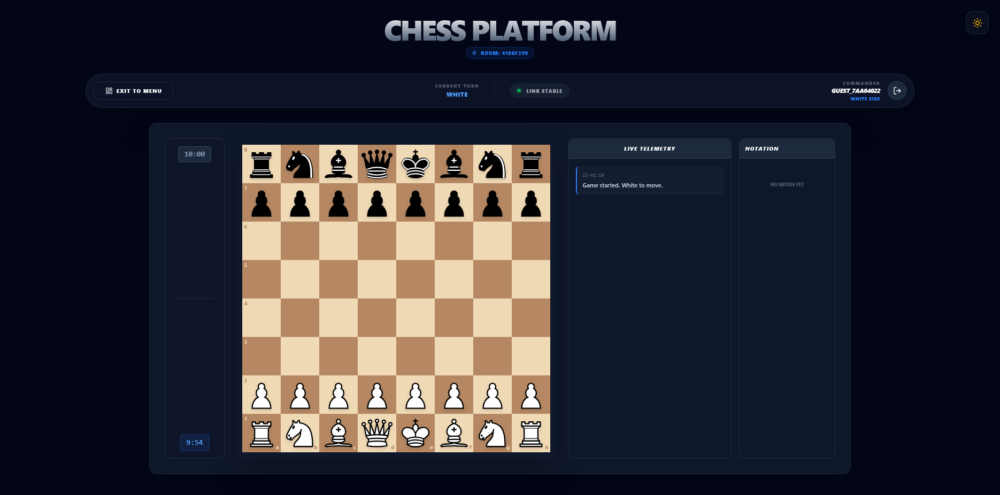

# ♟️ Chess Platform (Full-Stack Monorepo) ♔

**A high-performance, real-time chess ecosystem engineered with a focus on Domain-Driven Design (DDD), Clean Architecture, and Modern Java 17+ standards.**

---

### 📡 Project Status: Core Engine & UX Finalized
> **Operational Status:** The core chess engine is **100% operational**, strictly adhering to **FIDE rules**. The system maintains full synchronization between the **Spring Boot** backend (Server-Side Logic) and **React 19** frontend (State Management).
>
> **Current Sprint:** Transitioning from local engine verification to a global multiplayer ecosystem. I have successfully implemented **Phase 7 & 8**, establishing **JWT-based Authentication**, **Persistent ELO Tracking**, and **Server-Side Move Validation** to ensure a cheat-proof environment.

---

### 🛠️ Technology Stack & Modern Standards

**Backend:**

*(Utilizing **Sealed Classes** for piece hierarchies and **Records** for immutable DTOs)*

**Frontend:**

---

## 🏛️ Project Ecosystem & Governance
This project is architected as a **high-cohesion monorepo**. Operational processes and architectural decisions are managed through the following modules:

| Module / Document | Purpose & Brief | Location |
|:--- | :--- | :--- |
| **⚙️ Backend** | Core Chess Engine, API endpoints & Move validation logic | [`./chess-backend`](./chess-backend/README.md) |
| **🎨 Frontend** | Reactive UI components & Real-time board state management | [`./chess-frontend`](./chess-frontend/README.md) |
| **🏗️ Architecture** | High-level design choices (Hexagonal, DDD) & Tech patterns | [`./docs/ARCHITECTURE.md`](./docs/ARCHITECTURE.md) |
| **🚀 Setup Guide** | Comprehensive local environment & Dependency installation | [`./docs/DEVELOPMENT.md`](./docs/DEVELOPMENT.md) |
| **📝 Git Flow** | Contribution workflow, Branching strategy & Commit standards | [`./.github/GIT_GUIDE.md`](./.github/GIT_GUIDE.md) |
| **📜 Changelog** | Daily Evolution, version tracking & project milestones | [`./docs/CHANGELOG.md`](./docs/CHANGELOG.md) |
| **🛡️ Security** | Security policies, safety disclosure & best practices | [`./docs/SECURITY.md`](./docs/SECURITY.md) |
| **🤝 Contributing** | Coding standards, PR guidelines & collaboration rules | [`./docs/CONTRIBUTING.md`](./docs/CONTRIBUTING.md) |

---

## 🧠 Engineering Challenges & Solutions

### 1. Type-Safe Domain Modeling with Sealed Classes
* **The Challenge:** Handling diverse piece movements often leads to brittle `instanceof` checks that are prone to runtime failures.
* **The Solution:** I utilized **Java 17 Sealed Classes** to define a closed hierarchy for chess pieces. Combined with **Pattern Matching for switch**, the compiler now enforces exhaustive checks for every piece type.
* **The Result:** Eliminated "unhandled piece type" bugs and created a highly readable, self-documenting movement logic.

### 2. The "Single Source of Truth" Dilemma
* **The Challenge:** Initial client-side validations were vulnerable to manipulation via the browser console.
* **The Solution:** Migrated all logic to a **Server-Side Authority** in Spring Boot. The frontend now acts strictly as a "Viewer" and "Event Emitter."
* **The Result:** Every move is validated by the server-side engine before persisting to PostgreSQL, ensuring a 100% cheat-proof environment.

### 3. "Check" Validation Without Side Effects
* **The Challenge:** Validating King safety required executing a move, which risked corrupting the live game state.
* **The Solution:** Developed a **"Simulation & Rollback"** mechanism. The engine clones the state using **Java Records** for immutability, simulates the move on a virtual board, and then discards the simulation.

---

## 🎯 Engineering Highlights

### 🧩 Domain-Driven Design (DDD) & Clean Architecture
The core chess logic is encapsulated in a **Pure Java** domain layer.
* **Zero Infrastructure Leakage:** Move validation is entirely decoupled from Spring Boot, ensuring 100% testability.
* **Polymorphic Validation:** Each piece (`Rook`, `Bishop`, etc.) encapsulates its own logic, reducing conditional complexity.

### ⚡ Robust Rule Engine
* **FIDE Compliance:** Full support for [Castling](docs/assets/screenshots/gameplay-features/castling.png), [En Passant](docs/assets/screenshots/gameplay-features/en-passant.png), and [Pawn Promotion](docs/assets/screenshots/gameplay-features/pawn-promotion.png).
* **King Safety Simulation:** Dry-run execution to detect [Check](docs/assets/screenshots/gameplay-features/check.png), [Checkmate](docs/assets/screenshots/gameplay-features/checkmate.png), or Stale-mate.
* **Efficient Pathfinding:** Optimized vector-based collision detection for sliding pieces.

### 🔄 State Synchronization & UX
* **Modern React (v19):** Utilizing custom hooks and Tailwind CSS for a high-performance, responsive [Board UI](docs/assets/screenshots/gameplay-features/chess-board.png).
* **Lobby & Social:** Sophisticated [Lobby System](docs/assets/screenshots/gameplay-features/menu-page.png) and persistent [User Statistics](docs/assets/screenshots/ui-previews/checkmate-victory-screen.png) against players or the **Training Bot**.

---

## 🚀 Development Roadmap

*Current Status: ⏳ **Phase 10: Infrastructure & Containerization***

- ✅ **Phase 1: Foundation** 🏗️ - Monorepo scaffolding, environment setup, and Spring Boot/React initialization.
- ✅ **Phase 2: Domain Modeling** ♟️ - Piece-specific logic, board initialization, and DDD-based movement rules.
- ✅ **Phase 3: Rule Engine** ⚖️ - Legal move validation (King safety, check/mate detection) and FIDE standards.
- ✅ **Phase 4: Communication Layer** 📡 - WebSocket infrastructure using STOMP protocol and real-time event mapping.
- ✅ **Phase 5: UI Integration & Local Play** 🖥️ - Interactive React 19 board, Pawn Promotion, and Castling UI.
- ✅ **Phase 6: Visual Polish & UX** 🎨 - Dark/Light mode, theme support (Classic, Modern, Emerald), and Drag & Drop (`dnd-kit`).
- ✅ **Phase 7: Identity & Persistence** 🔐 - Implemented **Spring Security + JWT**, User profiles, and PostgreSQL integration.
- ✅ **Phase 8: Server-Side Authority** 🛡️ - Hardened backend validation for all moves and anti-cheat state management.
- ✅ **Phase 9: Remote Multiplayer & Matchmaking** 🤝 - Global session management and real-time player pairing via WebSockets.
- ⏳ **Phase 10: Infrastructure & Quality** 🐳 - Orchestrating services with **Docker & Docker Compose** and enhancing **JUnit 5/Mockito** test coverage.
- 📅 **Phase 11: Full-Stack Observability (LGTM)** 📈 - Implementing **Grafana, Loki, and Prometheus** for real-time logs, metrics, and system health.
- 📅 **Phase 12: Advanced Analytics & AI** 🧠 - Integration of **Stockfish** via UCI protocol for move analysis and "Hint" system.

---

## 👨‍💻 Developed By
**Batuhan Baysal** - *Software Engineer*
*Specializing in Scalable Software Design, Modern Java, and Backend Architectures.*

  
