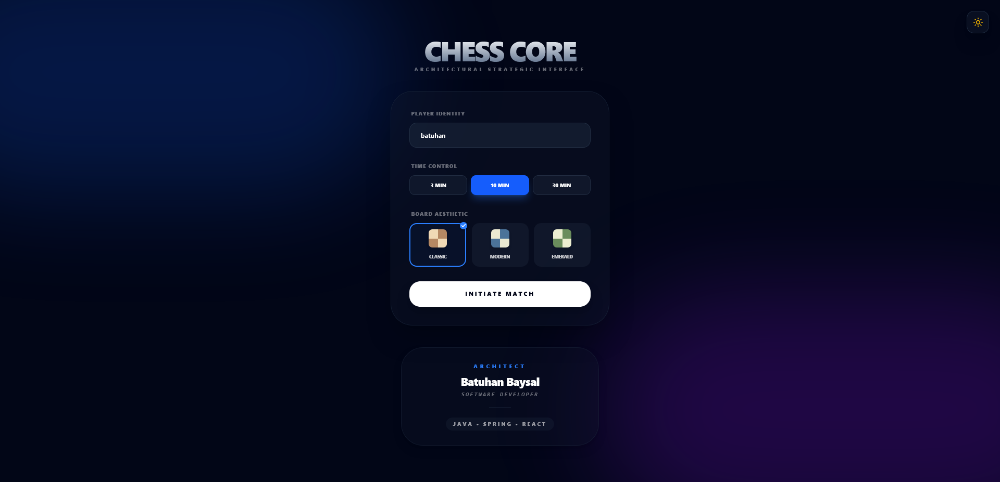
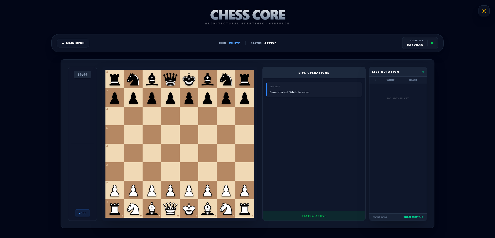

# ♟️ Chess Platform (Full-Stack Monorepo) ♔

**A high-performance, real-time chess ecosystem engineered with a focus on Domain-Driven Design (DDD), Clean Architecture, and Modern Java 17 standards.**

---

### 📡 Project Status: Core Engine & UX Finalized
> **Operational Status:** The core chess engine is 100% operational, supporting all FIDE rules (Castling, En Passant, Promotion) with full synchronization between the **Spring Boot** backend and **React 19** frontend.
>
> **Current Sprint:** Moving from local "Hot-seat" play to a global platform. I am currently implementing **Phase 7**, which focuses on **JWT-based Authentication**, **Persistent User Profiles**, and **Multiplayer Session Management** to support remote matches.

---

### 🛠️ Technology Stack

**Backend:**

**Frontend:**

---

## 🏛️ Project Ecosystem & Governance
This project is architected as a **high-cohesion monorepo**. Operational processes and architectural decisions are managed through the following modules:

| Module / Document | Purpose & Brief | Location |
|:--- | :--- | :--- |
| **⚙️ Backend** | Core Chess Engine, API endpoints & Move validation logic | [`./chess-backend`](./chess-backend/README.md) |
| **🎨 Frontend** | Reactive UI components & Real-time board state management | [`./chess-frontend`](./chess-frontend/README.md) |
| **🏗️ Architecture** | High-level design choices (Hexagonal, DDD) & Tech patterns | [`./docs/ARCHITECTURE.md`](./docs/ARCHITECTURE.md) |
| **🚀 Setup Guide** | Comprehensive local environment & Dependency installation | [`./docs/DEVELOPMENT.md`](./docs/DEVELOPMENT.md) |
| **📝 Git Flow** | Contribution workflow, Branching strategy & Commit standards | [`./.github/GIT_GUIDE.md`](./.github/GIT_GUIDE.md) |
| **📜 Changelog** | Daily Evolution, version tracking & project milestones | [`./docs/CHANGELOG.md`](./docs/CHANGELOG.md) |
| **🛡️ Security** | Security policies, safety disclosure & best practices | [`./docs/SECURITY.md`](./docs/SECURITY.md) |
| **🤝 Contributing** | Coding standards, PR guidelines & collaboration rules | [`./docs/CONTRIBUTING.md`](./docs/CONTRIBUTING.md) |

---

## 🎯 Engineering Highlights

### 🧩 Domain-Driven Design (DDD) & Clean Architecture
The core chess logic is encapsulated in a **Pure Java** domain layer.
* **Zero Infrastructure Leakage:** Move validation is entirely decoupled from Spring Boot, ensuring 100% testability.
* **Polymorphic Validation:** Leverages OOP principles where each piece (`Rook`, `Bishop`, etc.) encapsulates its own movement logic, significantly reducing conditional complexity in the `Game` engine.

### ⚡ Robust Rule Engine
* **FIDE Compliance:** Full support for **En Passant**, **Castling**, and **Pawn Promotion**.
* **King Safety Simulation:** Implements a dry-run execution mechanism (with automatic rollback) to verify move legality and detect Check/Checkmate/Stalemate states.
* **Efficient Pathfinding:** Optimized vector-based collision detection for sliding pieces.

### 🔄 State Synchronization
* **Modern React (v19):** Utilizing custom hooks and Tailwind CSS for a high-performance, responsive chess board.
* **WebSocket Integration:** Prepared for real-time move transmission using STOMP protocol.

---

## 🚀 Development Roadmap

*Current Status: ⏳ **Phase 7: Architecture Expansion (Identity & Persistence)***

- ✅ **Phase 1: Foundation** 🏗️ - Monorepo scaffolding, environment setup, and Spring Boot/React initialization.
- ✅ **Phase 2: Domain Modeling** ♟️ - Piece-specific logic, board initialization, and DDD-based movement rules.
- ✅ **Phase 3: Rule Engine** ⚖️ - Legal move validation (King safety, check/mate detection) and FIDE standards.
- ✅ **Phase 4: Communication Layer** 📡 - WebSocket infrastructure using STOMP protocol and real-time event mapping.
- ✅ **Phase 5: UI Integration & Local Play** 🖥️ - Interactive React 19 board, Pawn Promotion, and Castling UI.
- ✅ **Phase 6: Visual Polish & UX** 🎨 - Dark/Light mode, theme support (Classic, Modern, Emerald), Drag & Drop (`dnd-kit`), and Live Operation Logs.
- ⏳ **Phase 7: Identity & Persistence** 🔐 - Restructuring into a **Modular Monolith**. Implementing Spring Security + JWT, User/Guest profiles, and PostgreSQL integration.
- ⏳ **Phase 8: Server-Side Authority** 🛡️ - Server-side move validation, anti-cheat time synchronization, and backend-driven game state management.
- ⏳ **Phase 9: Remote Multiplayer & Matchmaking** 🤝 - Session management, lobby system, and real-time player pairing based on ELO ratings.

> **Note:** The project is evolving from a client-side heavy application to a robust, enterprise-grade chess platform focusing on **Domain-Driven Design (DDD)** and high-availability architecture.

---

## 👨‍💻 Developed By
**Batuhan Baysal** - *Software Engineer* *Specializing in Scalable Software Design and Modern Backend Architectures.*

  
