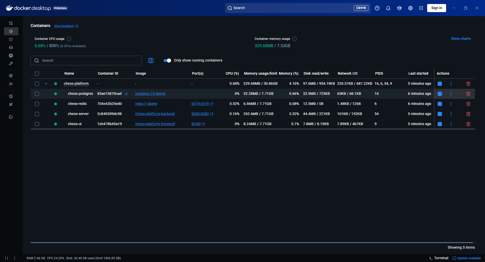

# ♟️ Chess Platform (Full-Stack Monorepo) ♔

**A high-performance, real-time chess ecosystem engineered with a focus on Domain-Driven Design (DDD), Clean Architecture, and Enterprise-Grade Infrastructure.**

---

### 📡 Project Status: Infrastructure & Containerization Finalized
> **Operational Status:** The core chess engine is **100% operational**, strictly adhering to **FIDE rules**.
>
> **Latest Milestone:** Successfully completed **Phase 10**, migrating the entire ecosystem to a **Dockerized** environment with **Liquibase** for database versioning. The system is now production-ready with automated service orchestration and health-check verified connectivity.

---

### 🛠️ Technology Stack & Engineering Standards

**Backend & Infrastructure:**

**Frontend:**

---

## 🏛️ Project Ecosystem & Governance
This project is architected as a **high-cohesion monorepo**. Operational processes and architectural decisions are managed through the following modules:

| Module / Document | Purpose & Brief | Location |
|:--- | :--- | :--- |
| **⚙️ Backend** | Core Chess Engine, API endpoints & Move validation logic | [`./chess-backend`](./chess-backend/README.md) |
| **🎨 Frontend** | Reactive UI components & Real-time board state management | [`./chess-frontend`](./chess-frontend/README.md) |
| **🏗️ Architecture** | High-level design choices (Hexagonal, DDD) & Tech patterns | [`./docs/ARCHITECTURE.md`](./docs/ARCHITECTURE.md) |
| **🚀 Setup Guide** | Comprehensive local environment & Dependency installation | [`./docs/DEVELOPMENT.md`](./docs/DEVELOPMENT.md) |
| **📝 Git Flow** | Contribution workflow, Branching strategy & Commit standards | [`./.github/GIT_GUIDE.md`](./.github/GIT_GUIDE.md) |
| **📜 Changelog** | Daily Evolution, version tracking & project milestones | [`./docs/CHANGELOG.md`](./docs/CHANGELOG.md) |
| **🛡️ Security** | Security policies, safety disclosure & best practices | [`./docs/SECURITY.md`](./docs/SECURITY.md) |
| **🤝 Contributing** | Coding standards, PR guidelines & collaboration rules | [`./docs/CONTRIBUTING.md`](./docs/CONTRIBUTING.md) |

---

## 🧠 Engineering Challenges & Solutions

### 1. Database Versioning & Schema Integrity (Liquibase)
* **The Challenge:** Relying on Hibernate's `ddl-auto: update` in a containerized environment is risky. Schema changes must be traceable, reversible, and consistent across all environments.
* **The Solution:** Integrated **Liquibase** to manage database migrations through versioned SQL changelogs.
* **The Result:** Professional, auditable database evolution. Guaranteed 1:1 schema parity between local development and Dockerized production environments.

### 2. Service Orchestration & Deterministic Startup
* **The Challenge:** In Docker Compose, services starting simultaneously can lead to "Connection Refused" errors if the backend tries to connect before the DB or Redis is ready.
* **The Solution:** Implemented custom **Docker Health-Checks** and `depends_on: service_healthy` conditions.
* **The Result:** The backend initializes only after PostgreSQL and Redis are fully "Healthy," ensuring a resilient, zero-fail deployment flow.

### 3. Simulation & Rollback Pattern
* **The Challenge:** Validating King safety (check detection) requires executing a move. This poses a risk of corrupting the live game state during the validation process.
* **The Solution:** Developed a **Simulation & Rollback** mechanism using **Java Records**. The engine clones the state, simulates the move on a virtual board, and discards it after safety verification.
* **The Result:** 100% side-effect-free move validation, ensuring total state integrity.

---

## 🎯 Engineering Highlights

### 🧩 Domain-Driven Design (DDD) & Clean Architecture
The core chess logic is encapsulated in a **Pure Java** domain layer.
* **Zero Infrastructure Leakage:** Move validation is entirely decoupled from Spring Boot, ensuring 100% unit testability.
* **Polymorphic Validation:** Each piece (`Rook`, `Bishop`, etc.) encapsulates its own logic, eliminating high-cyclomatic complexity from `switch-case` blocks.

### ⚡ Robust Rule Engine
* **FIDE Compliance:** Full support for [Castling](docs/assets/screenshots/gameplay-features/castling.png), [En Passant](docs/assets/screenshots/gameplay-features/en-passant.png), and [Pawn Promotion](docs/assets/screenshots/gameplay-features/pawn-promotion.png).
* **King Safety Simulation:** Dry-run execution to detect [Check](docs/assets/screenshots/gameplay-features/check.png), [Checkmate](docs/assets/screenshots/gameplay-features/checkmate.png), and Stalemate.
* **Efficient Pathfinding:** Optimized vector-based collision detection for sliding pieces to maintain high engine throughput.

### 🔄 State Synchronization & UX
* **Modern React (v19):** Utilizing custom hooks and Tailwind CSS for a high-performance, responsive [Board UI](docs/assets/screenshots/gameplay-features/chess-board.png).
* **Lobby & Social:** Sophisticated [Lobby System](docs/assets/screenshots/menu-page.png) and persistent [User Statistics](docs/assets/screenshots/ui-previews/checkmate-victory-screen.png) against players or the **Training Bot**.

---

## 🚀 Development Roadmap

*Current Status: 📈 **Phase 11: Full-Stack Observability (LGTM)***

- ✅ **Phase 1: Foundation** 🏗️ - Monorepo scaffolding, environment setup, and Spring Boot/React initialization.
- ✅ **Phase 2: Domain Modeling** ♟️ - Piece-specific logic, board initialization, and DDD-based movement rules.
- ✅ **Phase 3: Rule Engine** ⚖️ - Legal move validation (King safety, check/mate detection) and FIDE standards.
- ✅ **Phase 4: Communication Layer** 📡 - WebSocket infrastructure using STOMP protocol and real-time event mapping.
- ✅ **Phase 5: UI Integration & Local Play** 🖥️ - Interactive React 19 board, Pawn Promotion, and Castling UI.
- ✅ **Phase 6: Visual Polish & UX** 🎨 - Dark/Light mode, theme support (Classic, Modern, Emerald), and Drag & Drop (`dnd-kit`).
- ✅ **Phase 7: Identity & Persistence** 🔐 - Implemented **Spring Security + JWT**, User profiles, and PostgreSQL integration.
- ✅ **Phase 8: Server-Side Authority** 🛡️ - Hardened backend validation for all moves and anti-cheat state management.
- ✅ **Phase 9: Remote Multiplayer & Matchmaking** 🤝 - Global session management and real-time player pairing via WebSockets.
- ✅ **Phase 10: Infrastructure & Containerization** 🐳 - Orchestrating services with **Docker & Docker Compose** and implementing **Liquibase** for DB versioning.
- ⏳ **Phase 11: Full-Stack Observability (LGTM)** 📈 - Implementing **Grafana, Loki, and Prometheus** for real-time logs, metrics, and system health.
- 📅 **Phase 12: Quality Assurance & Code Integrity** 🏆 - Expanding **JUnit 5/Mockito** coverage and integrating **SonarQube** for automated "Zero Technical Debt" reporting.
- 📅 **Phase 13: Scalability & Resilience** ⚡ - Implementing **Resilience4j** (Circuit Breaker) and **Distributed Locking** with Redis.
- 📅 **Phase 14: Advanced Analytics & AI** 🧠 - Integration of **Stockfish** via UCI protocol for move analysis and "Hint" system.

---

## 🐳 Infrastructure & Containerization
The entire application ecosystem is managed using **Docker Compose** to ensure absolute consistency between development and production environments.

> **Infrastructure Note:** All services (PostgreSQL, Redis, Spring Boot, and React) include health-check protocols to ensure reliable inter-service communication and deterministic container startup sequences.

---

## 👨‍💻 Developed By
**Batuhan Baysal** - *Software Engineer*
*Scalable Software Design, Modern Java, and Backend Architectures.*

 
