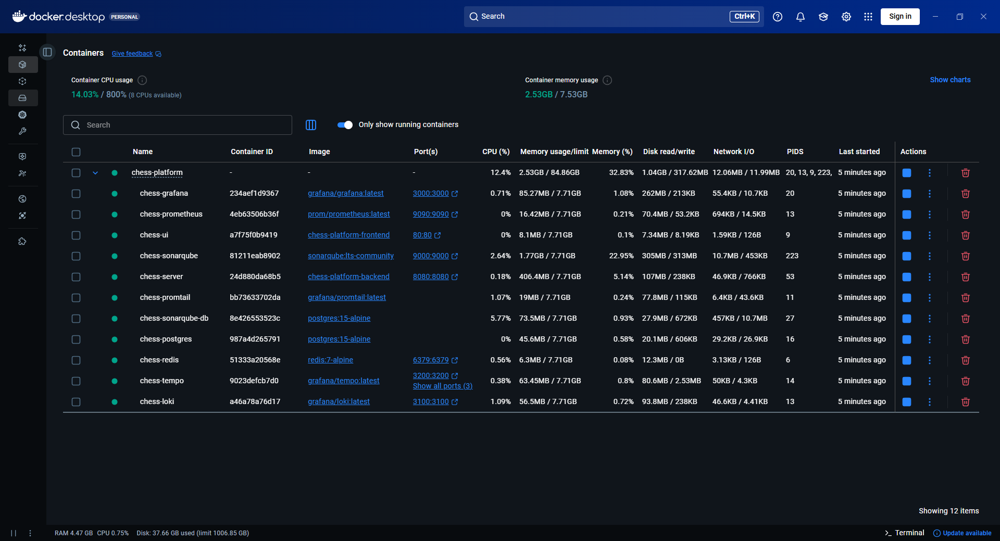

# ♟️ Chess Platform (v1.0.0) 

> *A Production-Ready Real-Time Chess Ecosystem Powered by Hexagonal Architecture and the LGTM Stack.*

**Backend & Infrastructure:**


**Observability & Monitoring:**


**Frontend:**


**Quality & CI/CD:**


**Build & Tools:**


---

## 📖 Overview
**Chess Platform** is a professional-grade, real-time multiplayer chess ecosystem. Designed as a **single source of truth** for game state, the platform synchronizes complex board interactions between the server and client with sub-millisecond precision.

> **In simple terms:** Think of this as a "referee-in-the-cloud" chess game. By keeping all the rules and timers on the server, we ensure that no player can cheat, the game remains perfectly synced for both sides, and your match progress is safe—even if you experience a temporary internet drop or a browser refresh.

### 🎯 What We Do
* **Secure Onboarding:** A robust authentication and registration flow ensures that every player interaction is verified and secure.
* **Server-Authoritative Gameplay:** The game logic resides entirely on the backend, preventing any client-side manipulation. Every move is strictly validated against FIDE rules before reaching the board.
* **Real-Time Synchronization:** Using a reactive, event-driven architecture, the platform guarantees that the board state and game timers are perfectly synchronized across all connected players.
* **Dynamic User Experience:** A feature-rich frontend provides a seamless transition from lobby navigation to high-intensity match play, complete with intuitive drag-and-drop mechanics.
* **Resilient Infrastructure:** From account security to session persistence, the platform is built to handle network interruptions gracefully, ensuring your game state is never lost.

---

### 🎬 Feature Highlights


> **Real-Time Multiplayer Synchronization:** A demonstration of the platform's reactive architecture. The side-by-side view shows a game session synchronized across two independent browser sessions, highlighting instant state updates, server-authoritative move validation, and low-latency WebSocket communication.

**Additional System Demonstrations:**
* **Authentication Workflow:** [View Demo](./docs/assets/videos/v1-auth-workflow.mp4) 🔐
* **Lobby & Navigation:** [View Demo](./docs/assets/videos/v1-lobby-navigation.mp4) 🧭
* **Board Interactivity:** [View Demo](./docs/assets/videos/v1-gameplay-board.mp4) ♟️

### 🖼️ System Snapshots & Observability
We leverage extensive monitoring and automated documentation to keep the platform performant and scalable.

* **Infrastructure & Monitoring:** [Explore Dashboard Assets](./docs/assets/dashboards/) 📊
* **System Overview:** [Infrastructure Snapshots](./docs/assets/screenshots/01-infrastructure/) 🏗️
* **Gameplay Features:** [UI & UX Highlights](./docs/assets/screenshots/02-gameplay-features/) ♟️
* **API Testing & Documentation:** [Test Reports & Swagger UI](./docs/assets/screenshots/03-api-testing/) 🧪

---

## 🏛️ Project Ecosystem & Governance
This project is architected as a **high-cohesion monorepo**. Operational processes and architectural decisions are managed through the following modules:

| Module / Document | Purpose & Brief | Location                                               |
| :--- | :--- |:-------------------------------------------------------|
| **⚙️ Backend** | Domain-Driven Chess Engine, REST/WebSocket APIs & FIDE logic | [`./chess-backend`](./chess-backend/README.md)         |
| **🎨 Frontend** | Reactive React 19 UI, Real-time state & Modular components | [`./chess-frontend`](./chess-frontend/README.md)       |
| **🏗️ Architecture** | Hexagonal patterns, DDD principles & Data flow design | [`./docs/ARCHITECTURE.md`](./docs/ARCHITECTURE.md)     |
| **🧪 Infrastructure** | LGTM observability stack, SonarQube & System resilience | [`./docs/INFRASTRUCTURE.md`](./docs/INFRASTRUCTURE.md) |
| **🚀 Deployment** | Production-ready container orchestration scripts | [`./deploy/monitoring`](./deploy/monitoring)                      |
| **🤖 CI/CD & Templates** | GitHub Actions workflows, Issue & PR templates | [`./.github`](./.github)                               |
| **🚀 Setup Guide** | Local environment config, Prerequisites & Dependency management | [`./docs/DEVELOPMENT.md`](./docs/DEVELOPMENT.md)       |
| **📝 Git Flow** | Version control standards, Branching & Conventional Commits | [`./docs/GIT_GUIDE.md`](./docs/GIT_GUIDE.md)           |
| **📜 Changelog** | Version history, Milestone tracking & Lifecycle events | [`./docs/CHANGELOG.md`](./docs/CHANGELOG.md)           |
| **🛡️ Security** | Authentication policies, Safety disclosures & Best practices | [`./docs/SECURITY.md`](./docs/SECURITY.md)             |
| **⚖️ Code of Conduct** | Community standards, Inclusion guidelines & Etiquette | [`CODE_OF_CONDUCT.md`](./CODE_OF_CONDUCT.md)           |
| **🤝 Contributing** | PR workflow, Issue templates & Collaboration standards | [`./docs/CONTRIBUTING.md`](./docs/CONTRIBUTING.md)     |
| **📜 License** | Project legal usage and distribution terms | [`LICENSE`](./LICENSE)                                 |

---

## 📋 Project Governance & Workflow
We maintain a strict professional workflow to ensure code quality and project transparency:

* **Agile Management:** Track our active roadmap, sprints, and task progress via the [**Chess Platform Kanban Board**](https://github.com/users/BatuhanBaysal/projects/2).
* **Release Lifecycle:** Track all version milestones, production-ready releases, and [**version tags**](https://github.com/BatuhanBaysal/chess-platform/tags) through our [**GitHub Releases**](https://github.com/BatuhanBaysal/chess-platform/releases).
* **Automation & Standardisation:** Our repository is governed by automated CI/CD workflows and standardized contribution templates for issue reporting and pull requests.
    * **Issue Tracking:** Use our pre-defined templates for [Bug Reports](https://github.com/BatuhanBaysal/chess-platform/issues/new?assignees=&labels=bug&template=bug_report.md) and [Feature Requests](https://github.com/BatuhanBaysal/chess-platform/issues/new?assignees=&labels=enhancement&template=feature_request.md).
    * **Pull Requests:** All contributions follow a strictly reviewed PR process using our standard [Pull Request Template](https://github.com/BatuhanBaysal/chess-platform/blob/main/.github/pull_request_template.md).

---

## 🚀 Quick Start
To spin up the entire ecosystem locally:
```bash
docker-compose up -d
```

*Detailed setup instructions are available in [Development Guide](./docs/DEVELOPMENT.md).*

---

## 🐳 Infrastructure & Containerization
The entire application ecosystem is managed using **Docker Compose** to ensure absolute consistency between development and production environments.



> **Resilient Orchestration:** All services (PostgreSQL, Redis, Spring Boot, and React) utilize automated health check protocols. This ensures deterministic startup sequences by enforcing dependency readiness (e.g., waiting for the database to be fully initialized before the application context starts), effectively preventing "Connection Refused" errors and race conditions during the initial boot phase.

---

## 🧠 Engineering Challenges & Solutions

### 1. 🗄️ Database Versioning & Schema Integrity (Liquibase)
* **The Challenge:** Hibernate's `ddl-auto: update` is risky in containerized environments. Schema changes must be traceable and consistent.
* **The Solution:** Integrated **Liquibase** to manage database migrations through versioned SQL changelogs.
* **The Result:** Professional, auditable database evolution with **guaranteed 1:1 schema parity** across all environments.

### 2. 🐳 Service Orchestration & Deterministic Startup
* **The Challenge:** Simultaneous service startup causes "Connection Refused" errors before DB/Redis readiness.
* **The Solution:** Implemented custom **Docker Health Checks** with `depends_on: service_healthy` conditions.
* **The Result:** A resilient, **zero-fail deployment flow** where services initialize in the correct order.

### 3. ♟️ Simulation & Rollback Pattern (Java Records)
* **The Challenge:** Validating King safety (check detection) risks corrupting live game state during execution.
* **The Solution:** Developed a cloning mechanism using immutable **Java Records** to simulate moves on a virtual board.
* **The Result:** **100% side-effect-free move validation**, ensuring total state integrity at every turn.

### 4. ⏱️ Server-Authoritative Timer & Synchronization
* **The Challenge:** Client-side timing is insecure, prone to drift, and susceptible to network latency or browser throttling.
* **The Solution:** Centralized timer orchestration in the **Backend (`GameService`)**, broadcasting heartbeats via WebSockets.
* **The Result:** **Absolute temporal consistency** across all clients, eliminating clock drift entirely.

### 5. 🛡️ Automated Quality Gate & Technical Debt (SonarQube)
* **The Challenge:** Preventing architectural decay and maintaining "Grade A" code quality in a rapidly evolving codebase.
* **The Solution:** Enforced a strict **SonarQube Quality Gate** in the CI/CD pipeline to block builds on coverage drops or security hotspots.
* **The Result:** Mechanized code hygiene with **>90% test coverage** and 0.0% duplication.

### 6. 🔌 WebSocket Session Resilience
* **The Challenge:** Network flickers or refreshes cause session loss and synchronization drift.
* **The Solution:** Implemented a **Stateful Reconnection Handler** with `gameId` handshakes to auto-sync state upon reconnection.
* **The Result:** A seamless user experience resilient to transient network failures.

### 7. 🔗 Atomic State Consistency (Redisson)
* **The Challenge:** Preventing race conditions in multi-node backends during concurrent move events.
* **The Solution:** Enforced **Atomic State Broadcasting** using Redisson distributed locks.
* **The Result:** Guaranteed protection against concurrency issues, ensuring a **Single Source of Truth** for the game state.

---

## 🎯 Engineering Highlights

* **🧩 Clean Architecture & DDD:** Core logic is encapsulated in a pure Java domain layer, strictly decoupled from infrastructure layers (Spring Boot/WebSockets).
* **⚡ Robust Rule Engine:** Full FIDE compliance (Castling, En Passant, Promotion) with server-authoritative timer enforcement.
* **🔄 Full-Stack Observability:** Real-time system health and distributed tracing managed by the **LGTM stack** (Loki, Grafana, Tempo, Prometheus).
* **🖥️ Modern React (v19) Stack:** High-performance UI utilizing Tailwind CSS and custom hooks for fluid, low-latency board interactions.
* **🏆 Zero Technical Debt:** CI/CD-driven mechanized quality standards, maintaining >90% test coverage through integrated SonarQube gates.

---

## 🚀 Development Roadmap

- ✅ **Phase 1: Foundation** 🏗️ - Monorepo scaffolding, environment setup, and Spring Boot/React initialization.
- ✅ **Phase 2: Domain Modeling** ♟️ - Piece-specific logic, board initialization, and DDD-based movement rules.
- ✅ **Phase 3: Rule Engine** ⚖️ - Legal move validation (King safety, check/mate detection) and FIDE standards.
- ✅ **Phase 4: Communication Layer** 📡 - WebSocket infrastructure using STOMP protocol and real-time event mapping.
- ✅ **Phase 5: UI Integration & Local Play** 🖥️ - Interactive React 19 board, Pawn Promotion, and Castling UI.
- ✅ **Phase 6: Visual Polish & UX** 🎨 - Dark/Light mode, theme support (Classic, Modern, Emerald), and Drag & Drop (`dnd-kit`).
- ✅ **Phase 7: Identity & Persistence** 🔐 - Implemented **Spring Security + JWT**, User profiles, and PostgreSQL integration.
- ✅ **Phase 8: Server-Side Authority** 🛡️ - Hardened backend validation for all moves and anti-cheat state management.
- ✅ **Phase 9: Remote Multiplayer & Matchmaking** 🤝 - Global session management and real-time player pairing via WebSockets.
- ✅ **Phase 10: Infrastructure & Containerization** 🐳 - Orchestrating services with **Docker & Docker Compose** and implementing **Liquibase** for DB versioning.
- ✅ **Phase 11: Full-Stack Observability (LGTM)** 📈 - Implementing **Grafana, Loki, and Prometheus** for real-time logs, metrics, and system health.
- ✅ **Phase 12: Quality Assurance & Code Integrity** 🏆 - Expanding **JUnit 5/Mockito** coverage and integrating **SonarQube** for automated "Zero Technical Debt" reporting.
- ✅ **Phase 13: Scalability & Resilience** ⚡ - Implementing **Resilience4j** (Circuit Breaker) and **Distributed Locking** with Redis.
- ✅ **Phase 14: Core Engine Refactoring & UX Optimization** ⚙️ - Server-authoritative timer logic and enhanced UI responsiveness/notation feed.

## 🔮 Future Work & Roadmap Milestones

We are committed to the long-term evolution of the platform. The following milestones represent our upcoming development focus:

### 🛠️ Phase 15: User Experience & Dashboard Expansion
* **User Profiles:** Implementing a dedicated profile management dashboard for personal statistics, account settings, and role-based interface adjustments.
* **Data Visualization:** Integrating interactive charts into the main menu to display player analytics.
* **Advanced Dashboards:** Creating a deep-dive analytics page for comprehensive match history, performance metrics, and global leaderboard data.

### 🛡️ Phase 16: Security, Resilience & Quality
* **Game State Integrity:** Enhancing the `WebSocket` reconnection handler to enforce a **"Dismiss = Loss"** policy; manual session dismissal will automatically trigger a resignation event to ensure fair play.
* **Performance & Security:** Implementing advanced request rate-limiting, hardened HTTP headers, and optimized JSON serialization for lower latency and increased throughput.
* **Testing Expansion:** Scaling **JUnit 5/Mockito** coverage to include deep-dive integration testing for security flows and edge-case game state scenarios.

### 👑 Phase 17: Administration & Operations
* **Admin Dashboard:** Developing a role-based administrative UI integrated into the existing profile system to manage users, monitor system health, and oversee global platform operations.
* **Production Deployment:** Transitioning to a live, cloud-native hosting environment and hardening the CI/CD pipeline for real-world observability and uptime.

### 🧠 Phase 18: Advanced Intelligence
* **AI Integration:** Implementing the **Stockfish** engine via UCI protocol to provide real-time move analysis, blunder detection, and hint mechanisms.

---

## 👨‍💻 Developed By
**Batuhan Baysal** - *Software Engineer*

[](https://linkedin.com/in/batuhan-baysal) [](https://github.com/BatuhanBaysal)
