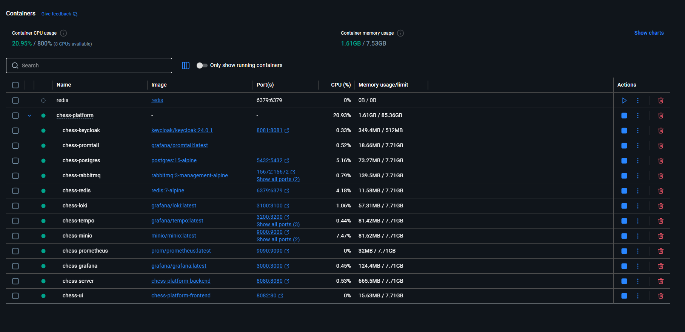

# ♟️ Chess Platform

> *An Enterprise-Grade, Full-Stack Chess Ecosystem Featuring Server-Authoritative Logic, AI Integration, and Robust Security.*

  

---

## 📖 Overview
**Chess Platform** is a professional-grade, real-time multiplayer chess ecosystem. Designed as a **single source of truth** for game state, the platform synchronizes complex board interactions between the server and client with sub-millisecond precision.

> **In simple terms:** Think of this as a "referee-in-the-cloud" chess game. By keeping all the core business logic, validation rules, and timers on the server, we ensure that client-side manipulation is impossible and the game remains perfectly synced.

> 💡 **Project Milestone & Stability:**
> The core chess ecosystem is fully stable, production-ready, and continuously optimized under enterprise architecture standards. You can track our ongoing improvements and roadmap via the [Chess Platform Kanban Board](https://github.com/users/BatuhanBaysal/projects/2).

### 🎯 What We Do
* **Secure Onboarding & RBAC:** A robust authentication flow featuring **Spring Security, JWT, and Role-Based Access Control (Admin vs. User)** with dedicated administrative dashboards.
* **Server-Authoritative Rule Engine:** **Developed entirely in-house using Java.** We do not rely on third-party APIs for game rules. Every move (Castling, En Passant, Promotion) is validated server-side by our custom domain logic to ensure 100% integrity.
* **Real-Time Multiplayer:** A reactive, event-driven architecture using WebSockets for seamless player-vs-player matches.
* **Integrated AI Training Mode:** Leveraging the industry-standard **Stockfish engine** as a local sidecar, allowing users to play against a powerful AI opponent in single-player sessions, while still utilizing our core server-authoritative logic for move validation.
* **Resilient Infrastructure:** Automated state recovery and connection management to handle network interruptions gracefully.

---

## 🏗️ Engineering Highlights

* **🧩 Custom FIDE Rule Engine:** Core game logic is encapsulated in a pure Java domain layer, ensuring complete control and zero reliance on external APIs for multiplayer validation.
* **🧠 Decoupled AI Sidecar & Telemetry Throttling:** Engine analysis integrated via the **UCI protocol** using a sidecar pattern. Features thread-safe concurrency management and throttled state broadcasting (`150ms`) to protect WebSocket throughput under heavy telemetry streams.
* **⚡ Hexagonal Architecture (Ports & Adapters):** Strict separation of concerns keeping the domain hexagon free from framework and database dependencies.
* **🔄 Full-Stack Observability & Tracing:** Real-time system health, centralized logging, and distributed tracing managed end-to-end by the **LGTM stack**.
* **🖥️ Modern React (v19) Stack & UI/UX:** High-performance user interface utilizing Tailwind CSS, interactive dashboards, and modular components designed for low-latency, real-time interaction.
* **🛡️ Server-Authoritative State Machine & RBAC:** Granular role-based access control protecting administrative operations via stateless JWT architecture, alongside decoupled business rules enforcing strict server-side validation to eliminate client-side tampering and race conditions.
* **🏆 Zero Technical Debt & Quality Gates:** CI/CD-driven quality standards enforced via **SonarQube** (Achieved **A-Grade Quality Gate** with **91.5% test coverage**).

> *For a deep dive into the underlying design patterns, concurrency controls, and architectural decisions, see our [Engineering Decisions Guide](docs/ENGINEERING_DECISIONS.md).*

---

### 🎬 Platform Walkthrough & Features

> *Curious about how everything comes together? This section walks you through the actual user journey, features, and capabilities built into the platform from scratch.*

#### 👥 Multiplayer Mode


> **Real-Time Multiplayer Synchronization:** A demonstration of the platform's reactive architecture. The side-by-side view shows a game session synchronized across two independent browser sessions, highlighting instant state updates, server-authoritative move validation, and low-latency WebSocket communication.

---

#### 🤖 Player vs. AI (Stockfish Engine) Mode


> **Engine Analysis & AI Match:** A demonstration of single-player training mode against the Stockfish AI opponent. This view highlights real-time move evaluations, live centipawn/mate scores via the evaluation bar, and intelligent engine hint suggestions guiding optimal move choices under high-frequency telemetry.

---

### 🗺️ The Complete User Journey & What I Built

As a solo developer, I designed and built this entire platform end-to-end to replicate a production-grade SaaS experience. Here is how users interact with the system and what happens behind the scenes:

* **🔐 Secure Authentication & Onboarding:** Users start by registering or logging in through a secure authentication flow powered by Spring Security and JWT, establishing their identity and role context.
* **🧭 Interactive Lobby & Navigation:** Once logged in, users land on a dynamic dashboard menu. From here, they can navigate through different game modes, inspect system health, check release updates via the changelog, or view project details.
* **♟️ Game Modes, Room Management & AI Integration:**
    * **Multiplayer & Room Control:** Players have full control over creating custom game rooms, configuring timers, selecting board themes, and joining existing lobbies. All game state data, move validations, and timers flow entirely from the backend; client-side manipulation is completely eliminated to guarantee zero cheating or race conditions.
    * **AI Training Mode & Difficulty Scaling:** Players can test their skills against the integrated **Stockfish engine** by choosing from configurable difficulty levels.
    * **Real-Time Move Hint Engine:** Available across both online multiplayer and AI match modes, an integrated engine-driven hint system assists players with optimal move suggestions.
* **📊 Player Stats, Leaderboard & Match History:** Every completed game is automatically persisted to PostgreSQL (running locally via Docker). The profile dashboard displays comprehensive analytics including overall **Win/Loss/Draw ratios**, **ELO ratings**, visual charts, and a detailed history of the **last 5 matches** (with a "View All" option for full match history). A global **Leaderboard** showcases the top players.
* **👑 Role-Based Access Control & Admin Dashboard:** Depending on the assigned user role, the UI dynamically adapts. Users with **Admin privileges** gain access to a dedicated Admin Dashboard to oversee users, manage system operations, and moderate matches.
* **🔄 Seamless Session Recovery:** If a user loses connection or refreshes mid-game, state-recovery handlers automatically re-sync their session using `gameId` handshakes so they can seamlessly jump right back into the action.

> **Visual Archives & Demos:** You can explore the complete visual catalog directly through our repository folders:
> * [Video Guides Directory](docs/assets/videos/) 🎬
> * [Screenshots & Dashboards Directory](docs/assets/screenshots/) 📸

---

## 🏛️ Project Ecosystem & Governance
This project is architected as a **high-cohesion monorepo**. Operational processes, architectural blueprints, and testing guides are documented across the following modules:

| Module / Document | Purpose & Brief | Location                                         |
| :--- | :--- |:-------------------------------------------------|
| **⚙️ Backend Engine** | Domain-Driven Chess Engine, REST/WebSocket APIs & FIDE logic | [chess-backend](chess-backend)                   |
| **🎨 Frontend UI** | Reactive React 19 UI, Real-time state & Modular components | [chess-frontend](chess-frontend)                 |
| **🏗️ Architecture** | Unifies hexagonal patterns, DDD principles, and data flow design | [docs/ARCHITECTURE.md](docs/ARCHITECTURE.md)     |
| **🧠 Engineering Decisions** | Deep-dive into concurrency controls, security layers, and patterns | [docs/ENGINEERING_DECISIONS.md](docs/ENGINEERING_DECISIONS.md) |
| **🧪 Testing Strategy** | Unit, integration slice tests, and SonarQube quality metrics | [docs/TESTING.md](docs/TESTING.md)               |
| **📊 Infrastructure** | Details the LGTM observability stack, SonarQube, and system resilience | [docs/INFRASTRUCTURE.md](docs/INFRASTRUCTURE.md) |
| **🚀 Deployment** | Production-ready container orchestration and monitoring scripts | [deploy/monitoring](deploy/monitoring)           |
| **🤖 CI/CD & Templates** | GitHub Actions workflows, Issue & PR templates | [.github](.github)                               |
| **🚀 Setup Guide** | Local environment config, prerequisites, and dependency management | [docs/DEVELOPMENT.md](docs/DEVELOPMENT.md)       |
| **📝 Git Flow** | Version control standards, branching strategies, and conventional commits | [docs/GIT_GUIDE.md](docs/GIT_GUIDE.md)           |
| **📜 Changelog** | Version history, milestone tracking, and lifecycle events | [docs/CHANGELOG.md](docs/CHANGELOG.md)           |

**Additional Resources & Policies:** For further details, please review our [Security Policy](docs/SECURITY.md), [Code of Conduct](CODE_OF_CONDUCT.md), [Contributing Guidelines](docs/CONTRIBUTING.md), and project [License](LICENSE).

---

## 🚀 Quick Start

Ensure you have [Docker](https://www.docker.com/) and Docker Compose installed on your machine.

To spin up the core services (Backend, Frontend, DB, Redis) required for development:

```bash
docker compose --profile core up -d
```

To spin up the entire ecosystem, including monitoring tools and SonarQube:

```bash
docker compose --profile core --profile monitoring up -d
```

*For detailed setup instructions, please refer to the [Development Guide](docs/DEVELOPMENT.md).*

---

## 🐳 Infrastructure & Containerization
The entire application ecosystem is managed using **Docker Compose** to ensure absolute consistency between development and production environments.



> **Resilient Orchestration & Health Checks:** All core services and observability tools utilize automated health check protocols and strict dependency ordering (e.g., ensuring PostgreSQL and Redis are fully ready before the Spring Boot backend initializes). This deterministic boot sequence effectively eliminates race conditions and "Connection Refused" errors during startup.

---

## 📋 Project Governance & Workflow
We maintain a strict professional workflow to ensure code quality, automated validation, and project transparency:

* **Agile Management:** Track our active roadmap, sprints, and task progress via the [**Chess Platform Kanban Board**](https://github.com/users/BatuhanBaysal/projects/2).
* **Release Lifecycle:** Track all version milestones, production-ready releases, and [**version tags**](https://github.com/BatuhanBaysal/chess-platform/tags) through our [**GitHub Releases**](https://github.com/BatuhanBaysal/chess-platform/releases).
* **Continuous Integration & Quality Gates:** Code health, automated test suites, and build pipelines are continuously validated via **GitHub Actions**. You can inspect the status of active workflows, build statuses, and quality checks directly on our [**GitHub Actions Pipeline**](https://github.com/BatuhanBaysal/chess-platform/actions).
* **Automation & Standardisation:** Our repository is governed by standardized contribution templates for issue reporting and pull requests.
    * **Issue Tracking:** Use our pre-defined templates for [Bug Reports](https://github.com/BatuhanBaysal/chess-platform/issues/new?assignees=&labels=bug&template=bug_report.md) and [Feature Requests](https://github.com/BatuhanBaysal/chess-platform/issues/new?assignees=&labels=enhancement&template=feature_request.md).
    * **Pull Requests:** All contributions follow a strictly reviewed and automated PR verification process using our standard [Pull Request Template](https://github.com/BatuhanBaysal/chess-platform/blob/main/.github/pull_request_template.md).

---

### 💡 Behind the Code: My Journey with This Project

> *“This platform is the culmination of a continuous learning curve that started during my corporate internship in the summer of 2024, where I first laid hands on Java, Spring Boot, React, and PostgreSQL.”*

After graduation, through dedicated self-study, online programs, and hands-on GitHub development, I wanted to build something that goes beyond standard CRUD applications. This project stands as my most comprehensive and production-grade work to date:
* **The Stack Evolution:** Building upon my prior secure full-stack applications, I elevated my workflow by incorporating containerization with **Docker** and full-stack observability via the **LGTM stack**.
* **Pushing Technical Boundaries:** To build the multiplayer feature, I moved past conventional request-response cycles to master **WebSockets** for event-driven real-time synchronization. Integrating the **Stockfish engine** also gave me hands-on experience with UCI protocols, sidecar patterns, and thread-safe telemetry handling.
* **Engineering Discipline:** Rather than treating this as a casual hobby project, I managed its lifecycle with strict enterprise governance—leveraging GitHub Issues, PR workflows, Milestones, Tags, Releases, and comprehensive documentation.

> **What This Project Taught Me as an Engineer:**
> Successfully completing this end-to-end ecosystem fundamentally transformed how I approach software development:
> * **Taking Full Ownership:** Steering a complex multi-module project entirely by myself taught me how to bridge frontend, backend, and infrastructure gaps independently without relying on external scaffolding.
> * **Architectural Resilience & Decision Making:** I learned how to anticipate edge cases—such as network disconnections, state inconsistencies, and concurrent race conditions—and design structural safeguards from day one rather than fixing them reactively.
> * **From Code to Product Mindset:** Moving past isolated coding exercises, I gained the confidence to manage a product's entire lifecycle, balancing code maintainability, automated quality gates, and structured documentation just like a professional production environment.

---

## 👨‍💻 Developed By
**Batuhan Baysal** - *Software Engineer*

[](https://linkedin.com/in/batuhan-baysal) [](https://github.com/BatuhanBaysal)
