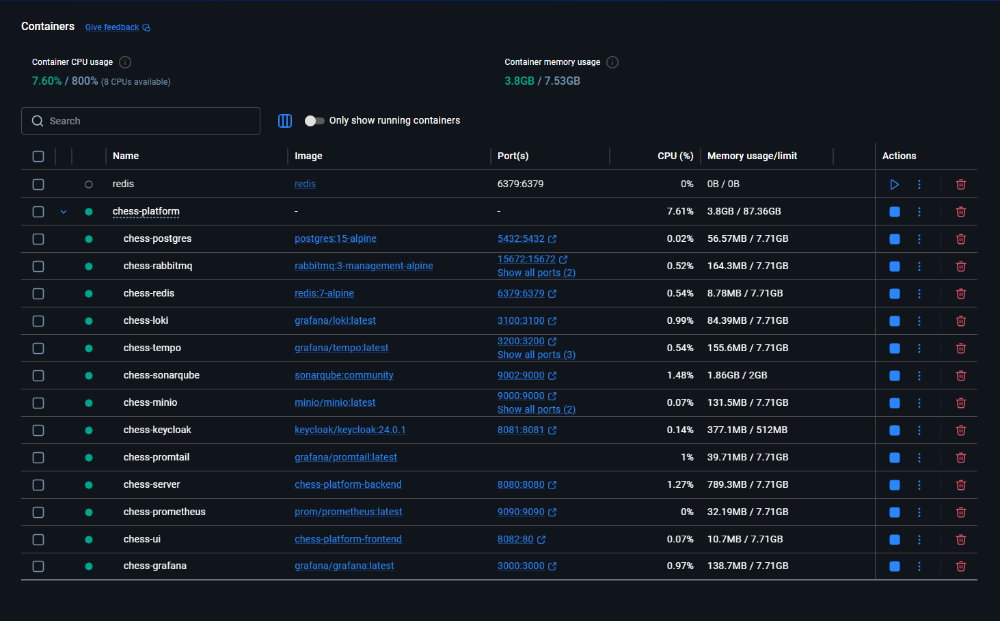

# ♟️ Chess Platform

> *A Full-Stack Chess Ecosystem Featuring Server-Authoritative Logic, AI Integration, Asynchronous Eventing, and Hybrid Cloud Production Deployment.*

  [](https://chess-platform-app.vercel.app) 

> **Try it:** open the [live demo](https://chess-platform-app.vercel.app) → **Play as Guest** → **Play vs Computer**. No sign-up needed.

## 🛠️ Technology Stack
- **Backend:** Java 17 • Spring Boot 3.4 • Spring Security • OAuth2 (Keycloak) • WebSocket (STOMP) • Spring Data JPA • Liquibase • MapStruct • Lombok • SpringDoc OpenAPI • AWS SDK S3 • Resilience4j • Redisson • Stockfish UCI Engine • Testcontainers
- **Frontend:** React 19 • TypeScript • Vite • Vitest • React Testing Library • Playwright • Tailwind CSS v4 • React Router v7 • Axios • SockJS / STOMP • Recharts • DnD Kit • Lucide React
- **Infrastructure & Data:** PostgreSQL 15 • Redis 7 • RabbitMQ • MinIO • Docker Compose • Oracle Cloud Infrastructure (OCI) • Vercel
- **Observability & Quality:** Prometheus • Grafana • Loki • Tempo • Promtail • OpenTelemetry • JaCoCo • SonarQube

---

## 📖 Overview

**Chess Platform** is a real-time multiplayer chess ecosystem built with clean architecture and strict server-authoritative state management, deployed live on Oracle Cloud and Vercel. All game rules, timers, and state transitions execute entirely on the server to prevent client-side manipulation, synchronized via a low-latency, throttled WebSocket pipeline.

### 🎯 Core Capabilities

* **Identity & RBAC:** Centralized authentication via **Keycloak (OAuth2/OIDC Resource Server)** with fine-grained Role-Based Access Control and admin dashboards.
* **Pure In-House Rule Engine:** FIDE-compliant chess logic (Castling, En Passant, Promotion) developed natively in Java with zero third-party rule dependencies.
* **Event-Driven Multiplayer & Asynchronous Analytics:** Low-latency bidirectional WebSocket pipelines combined with **RabbitMQ** message brokers to decouple heavy Stockfish post-game analysis from core gameplay threads.
* **Stockfish AI Sidecar:** Integrated UCI-compliant engine for AI match play and live centipawn/mate evaluation telemetry.
* **Hybrid Storage Architecture:** Decoupled avatar uploads and PGN game exports, supporting local MinIO and cloud-native OCI Object Storage via standard S3 SDK abstractions.

---

## 🏗️ Engineering Highlights

* **🧩 Clean / Hexagonal Architecture:** Strict separation between core domain rules, application use cases, and infrastructure adapters (Spring Boot, Keycloak, S3, PostgreSQL, RabbitMQ).
* **🧠 UCI Engine Sidecar & Throttling:** Thread-safe Stockfish subprocess management with throttled state broadcasting (`150ms`) to protect WebSocket throughput under heavy telemetry.
* **⚡ Resilient Concurrency & Recovery:** Server-authoritative state machine with per-game distributed locks (Redisson) to serialize concurrent moves, plus deterministic session recovery for dropped connections.
* **🔄 Full-Stack Observability & Tracing:** Distributed tracing via **OpenTelemetry Java Agent**, metric collection, and structured logging unified across the **LGTM stack** (Loki, Grafana, Tempo, Prometheus).
* **🖥️ Modern React 19 Frontend:** State-driven UI built with React 19, TypeScript, and Tailwind CSS for responsive board rendering and match interactions.
* **🏆 Testing & Quality:** Testing pyramid with Vitest and React Testing Library for components, Playwright for end-to-end flows, and Testcontainers (real PostgreSQL) for backend integration tests. **74.0% backend coverage** (JaCoCo).
* **🌐 Production Cloud Deployment:**
    * **Frontend:** Deployed globally on Vercel for high-speed edge delivery.
    * **Backend & Infrastructure:** Containerized via Docker Compose on Oracle Cloud Infrastructure (ARM/Ampere VPS) with DuckDNS dynamic routing.

> *For an in-depth breakdown of architectural patterns, concurrency controls, and design tradeoffs, refer to the [Engineering Decisions Guide](docs/ENGINEERING_DECISIONS.md).*

---

## 🎬 Platform Walkthrough


* **⚡ Real-Time Play:** Rooms with custom time controls (3, 10, 30 min) and board themes; server-validated moves and automatic session recovery after dropped connections.
* **♟️ Play vs Computer:** Configurable Stockfish difficulty levels with a live evaluation bar and move hints.
* **🏅 Accounts & Ratings:** Registered players start at 1200 ELO; guests start at 400 ELO and expire after 7 days. Every outcome (checkmate, stalemate, draw, timeout, resignation) is persisted to PostgreSQL, feeding the leaderboard, match history, and win/loss dashboards. The `ADMIN` role unlocks a monitoring dashboard.

Explore visual assets: [Video Guides](docs/assets/videos/) 🎬 | [Screenshots & Dashboards](docs/assets/screenshots/) 📸

---

## 🏛️ Project Ecosystem, Governance & Workflow

This project is architected as a **high-cohesion monorepo** with operational processes, architectural blueprints, and testing guides documented across the core modules:

| Module / Document | Purpose & Brief                                                           | Location                                         |
| :--- |:--------------------------------------------------------------------------|:-------------------------------------------------|
| **⚙️ Backend Engine** | Domain-Driven Chess Engine, REST/WebSocket APIs & FIDE logic              | [chess-backend](chess-backend)                   |
| **🎨 Frontend UI** | Reactive React 19 UI, Real-time state & Modular components                | [chess-frontend](chess-frontend)                 |
| **🏗️ Architecture** | Unifies hexagonal patterns, DDD principles, and data flow design          | [docs/ARCHITECTURE.md](docs/ARCHITECTURE.md)     |
| **🧠 Engineering Decisions** | Deep-dive into concurrency controls, security layers, and patterns        | [docs/ENGINEERING_DECISIONS.md](docs/ENGINEERING_DECISIONS.md) |
| **🧪 Testing Strategy** | Unit, integration slice tests, and code quality metrics                   | [docs/TESTING.md](docs/TESTING.md)               |
| **📊 Infrastructure** | Details the LGTM observability stack, Keycloak, MinIO, and system resilience    | [docs/INFRASTRUCTURE.md](docs/INFRASTRUCTURE.md) |
| **🚀 Deployment** | Production-ready container orchestration and monitoring scripts           | [deploy/monitoring](deploy/monitoring)           |
| **🤖 CI/CD & Templates** | GitHub Actions workflows, Issue & PR templates                            | [.github](.github)                               |
| **🚀 Setup Guide** | Local environment config, prerequisites, and dependency management        | [docs/DEVELOPMENT.md](docs/DEVELOPMENT.md)       |
| **📝 Git Flow** | Version control standards, branching strategies, and conventional commits | [docs/GIT_GUIDE.md](docs/GIT_GUIDE.md)           |
| **📜 Changelog** | Version history, milestone tracking, and lifecycle events                 | [docs/CHANGELOG.md](docs/CHANGELOG.md)           |

Live project tracking via the [Kanban Board](https://github.com/users/BatuhanBaysal/projects/2) and versioned [Releases](https://github.com/BatuhanBaysal/chess-platform/releases). Governance policies: [Security Policy](docs/SECURITY.md), [Code of Conduct](CODE_OF_CONDUCT.md), [Contributing Guidelines](docs/CONTRIBUTING.md), [License](LICENSE).

---

## 🐳 Infrastructure & Containerization
The entire application ecosystem runs via **Docker Compose** with segmented profiles (`core`, `monitoring`, `storage-local`, `quality`) for parity between local development and production.



> **Health Checks & Startup Ordering:** The Spring Boot backend only starts after PostgreSQL, Redis, RabbitMQ, and Keycloak report healthy, which avoids "connection refused" errors on cold boot. Object storage (MinIO, local profile only) starts independently.

---

## 🚀 Quick Start

Prerequisite: [Docker](https://www.docker.com/) & Docker Compose.

### Local Development

* **Core Stack (Backend, Frontend, PostgreSQL, Redis, RabbitMQ, Keycloak):**
```bash
  docker compose --profile core up -d
```

* **Full Local Stack (Core + MinIO + SonarQube + Monitoring):**
```bash
  docker compose --profile core --profile storage-local --profile quality --profile monitoring up -d
```

* **Running Backend via IDE:** Start dependent services with Docker, set the Spring active profile to `local`, and load your root `.env` via the IntelliJ EnvFile plugin.

### Production Deployment

1. **Connect & Update:**
```bash
   ssh -i "/path/to/key.key" ubuntu@<SERVER_IP>
   cd ~/chess-platform && git pull origin main
```

2. **Restart Services:**
```bash
   docker compose down   # Keep data volumes intact (use -v only for a hard reset)
   docker compose --profile core up --build -d
```

See the [Development Guide](docs/DEVELOPMENT.md) for full configuration details.

---

## 💡 Behind the Code: My Journey with This Project

> *"This platform is the culmination of a continuous learning curve that started during my internship at Chippin (part of Koç Group) in the summer of 2024, where I first laid hands on Java, Spring Boot, React, and PostgreSQL."*

After graduation, through self-study and hands-on GitHub development, I wanted to build something that goes beyond standard CRUD applications. This project is where most of my learning actually happened:

* **Learning by Getting It Wrong First:** The authentication layer started as a hand-rolled JWT implementation. It worked, but maintaining my own token lifecycle, role mapping, and session handling taught me exactly why that's a solved problem — so I migrated the whole thing to **Keycloak (OAuth2/OIDC)**. Rewriting something I'd already "finished" was the most useful thing I did on this project.
* **Distributed Real-Time Systems:** Building multiplayer meant moving past conventional request-response cycles to **WebSockets** and event-driven state sync. Integrating the **Stockfish engine** pushed me further into UCI protocols, sidecar patterns, and thread-safe process telemetry — areas I had no exposure to beforehand.
* **Resilience by Design:** The health-check ordering described above didn't start as a plan — it came from watching real games break under race conditions and containers crash-loop on cold boot. I stopped patching symptoms and started designing for concurrency and dependency ordering from day one.
* **Engineering Rigor:** Rather than treating this as a casual side project, I ran its lifecycle the way I'd want to work on a team — milestone-driven sprints, a PR-based workflow with CI checks, Liquibase migrations, AAA-style tests, and tagged GitHub Releases for every milestone.

What I'd tell a past version of myself: building the feature is the easy half. Deciding *why* it should be built that way, and being willing to throw out working code when the reasoning doesn't hold up, is where the actual engineering is.

---

## 👨‍💻 Developed By
**Batuhan Baysal** - *Junior Software Developer*

[](https://linkedin.com/in/batuhan-baysal) [](https://github.com/BatuhanBaysal)
