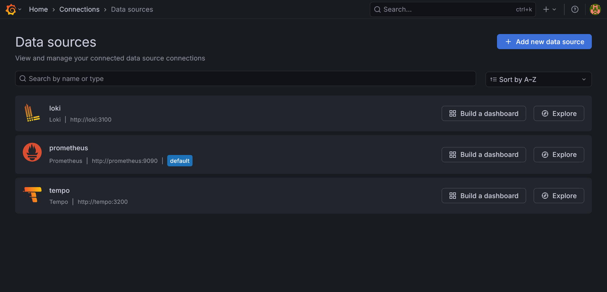

# ♟️ Chess Platform - Backend


The core engine of the Chess Platform, built with **Domain-Driven Design (DDD)** and **Hexagonal (Ports & Adapters) Architecture**. It provides a high-concurrency, resilient environment for real-time chess gameplay.

---

## 🖼️ Visuals


*Overview of the LGTM (Loki, Grafana, Tempo, Mimir/Prometheus) stack integration, demonstrating end-to-end observability from metrics to distributed traces.*

### 🖼️ Feature Gallery
For a detailed visual breakdown of the backend system health, infrastructure monitoring, and API validation, you can browse the full collection of proofs:

* [**View Observability Stack Proofs**](../docs/assets/screenshots/01-infrastructure/observability-stack/)
* [**View API Testing Proofs**](../docs/assets/screenshots/03-api-testing/)

*Note: The documentation includes visual evidence of JVM performance metrics, distributed tracing logs via Tempo, and successful API/WebSocket integration handshake flows.*

---

## 📝 Project Overview
I developed this backend to create a "Single Source of Truth" that ensures game integrity while providing a fast, real-time experience.

**What I actually built and my contributions:**
* **Chess Engine Core:** Designed a pure Java, framework-agnostic engine that performs move validation and state simulations.
* **Concurrency Management:** Implemented distributed locking with Redisson to ensure thread safety during simultaneous game requests.
* **API Design:** Built a real-time WebSocket architecture (STOMP) for low-latency move broadcasting and state synchronization.
* **Clean Architecture:** Enforced strict domain boundaries, separating core business rules from external infrastructure concerns to ensure long-term maintainability.

---

## 🏗️ Architecture & Philosophy
This backend follows a strict **Hexagonal Architecture** pattern to keep the **Chess Logic** isolated from technical frameworks, mirroring our frontend's domain structures.

* **Domain Layer (The Core):** 🧠 A framework-agnostic, **FIDE-compliant Chess Engine**. It handles move validation, King safety simulations, and complex game-ending conditions. It is pure Java with zero dependencies.
* **Application Layer (Services):** 🔄 Orchestrates use cases like starting games and making moves. It handles transaction management and cross-cutting concerns.
* **API Layer (Drivers):** 🔌 REST Controllers and **WebSocket (STOMP)** handlers for real-time synchronization with the frontend.
* **Infrastructure Layer (Adapters):** 💾 External concerns like **PostgreSQL** persistence (JPA), Security configurations, and Redis caching.

---

## 🚀 Engineering Pillars
* **Server-Side Authority (SSOT):** Complete migration of game logic to the backend. All move validations, timer synchronizations, and game state transitions are strictly enforced by the server to prevent client-side manipulation.
* **Simulative Move Safety:** Sophisticated check-detection mechanism using temporary state simulation with **atomic rollback** (`try-finally`) to ensure moves never leave the King vulnerable.
* **Polymorphic Move Validation:** Leveraging OOP principles where each `Piece` subclass encapsulates its own movement rules, eliminating complex conditional logic in the core engine.
* **Modern Java 17+ Standards:** Extensive use of **Sealed Classes** and **Pattern Matching** for the piece hierarchy, and **Records** for immutable DTOs and thread-safe state snapshots.

---

## 🛠️ Technology Stack
The project leverages industry-standard libraries to provide a robust, resilient, and observable environment.

| Category | Technology | Purpose |
| :--- | :--- | :--- |
| **Core** | Spring Boot 3.4.6, Java 17 | Modern and type-safe business logic. |
| **Database** | PostgreSQL, Liquibase | Schema management and versioning. |
| **Security** | Spring Security, JJWT | Secure authentication and authorization. |
| **Resilience** | Resilience4j | Fault tolerance (Circuit Breaker, Rate Limiter). |
| **Distributed** | Redisson (Redis) | Distributed locking and cache management. |
| **Observability** | Micrometer, Prometheus | System metrics and tracing. |

---

## 🚀 Getting Started

> 💡 **For full-stack setup, database configurations, and CI/CD pipelines, please refer to the [Development & Setup Guide](../docs/DEVELOPMENT.md).**

### Prerequisites
* Java 17+
* Maven 3.9+
* PostgreSQL 15+ (for persistence)
* Redis 7+ (for caching and distributed locks)
* Docker (optional, for containerized environment)

### Installation
```bash
# Build the project
./mvnw clean install
```

### Running the Application
```bash
# Start the application locally
./mvnw spring-boot:run
```

---

## 🛠️ Available Scripts
In the project directory, you can run:

* `./mvnw clean install` - Builds the project and runs the test suite.
* `./mvnw spring-boot:run` - Starts the application locally.
* `./mvnw test` - Executes unit and integration tests.

---

## ⚙️ Environment Variables
The application relies on a `.env` file for configuration. Before running, create a `.env` file in the root directory using the template below.

> ⚠️ **Security Warning:** Never commit your actual `.env` file to version control. Use `.env.example` as a template for team members.

---

## 🐳 Docker Deployment
We utilize a **multi-stage Docker build** process to minimize image size and maximize security.

1. **Build Stage:** Uses `maven:3.9-eclipse-temurin-17` to compile code and package the application.
2. **Runtime Stage:** Uses `eclipse-temurin:17-jre-alpine`, reducing the attack surface and deployment footprint.

```bash
# Build the image
docker build -t chess-backend .

# Run the system using orchestration
docker-compose up -d backend
```

---

## 🧪 Testing Strategy
Our testing methodology ensures high code quality through a layered approach, utilizing **JUnit 5**, **Mockito**, and **Spring Boot Test**.

* **Web Layer (Controllers):** Validated using `@WebMvcTest`. Tests HTTP endpoints, JSON serialization/deserialization, and contract adherence in isolation.
* **Business Layer (Services):** Validated using `MockitoExtension` to test service logic without relying on external databases or caches.
* **Test Isolation:** We use an H2 in-memory database, with Redis/Redisson explicitly disabled to ensure fast feedback loops and build stability.
* **Organization:** Test suites utilize `@Nested` classes to group related functionality (e.g., registration, login, move execution).

---

## 🛠️ Technical Best Practices
To maintain high performance and code quality, please follow these guidelines:

* **Concurrency Control:** Always use `@RLock` via Redisson for game state operations to prevent race conditions during simultaneous move requests.
* **Transactional Integrity:** Keep business transactions within the `Application Layer` to ensure the core Domain remains pure and testable.
* **Observability:** Monitor critical game flows using Micrometer metrics; ensure every major action is traced in Prometheus/Grafana.

---

## 📁 Source Code Structure (Main)
- This section contains the core business logic and the layered architecture required for the application to function.

```text
src/main/
├── java/com/batuhan/chess/
│                    ├── api/                        # Infrastructure Layer: External interfaces
│                    │   ├── config/                 # Protocol configurations (Security, WebSocket, CORS)
│                    │   ├── controller/             # REST Controllers & WebSocket Handlers
│                    │   ├── dto/                    # Data Transfer Objects (Records)
│                    │   └── exception/              # Global API error handling
│                    ├── application.service/        # Application Layer: Use case orchestration
│                    │   ├── auth/                   # Identity and access management
│                    │   └── game/                   # Game session coordination
│                    ├── domain/                     # Domain Layer: Pure business logic
│                    │   ├── model/                  # Aggregates and Entities
│                    │   │   ├── chess/              # Chess logic/Board
│                    │   │   ├── history/            # Persistent match tracking
│                    │   │   └── user/               # User aggregate models
│                    │   └── repository/             # Repository INTERFACES
│                    └── ChessBackendApplication     # Main application entry point                                
└── resources/
    ├── application.yaml                        # Main application configuration properties
    └── db.changelog/                           # Liquibase database migration configuration root
        ├── changes/                            # Contains individual SQL migration scripts
        │   └── 001-initial-schema.sql          # Initial database schema definition file
        └── db.changelog-master.xml             # Master file to track all migrations
```

## 🧪 Test Structure (Test)
- This section houses the test classes and resources used to verify the correctness of each layer and ensure application reliability.

```text
src/test/
├── java/com/batuhan/chess/
│   ├── api/                         # API Layer unit & integration tests
│   │   ├── config/
│   │   ├── controller/
│   │   ├── dto.game/
│   │   └── exception/
│   ├── application.service/         # Application layer business logic tests
│   │   ├── auth/
│   │   └── game/
│   ├── domain.model/                # Domain layer core tests
│   │   ├── chess/
│   │   ├── history/
│   │   └── user/
│   └── ChessBackendApplicationTests # Main application context test
└── resources/
    └── application.yml              # Test-specific configuration
```

---

## ⚠️ Troubleshooting
* **Database Connection:** Verify that PostgreSQL is running and your `CHESS_DB_URL` in `.env` is reachable.
* **Redis Failures:** Ensure the Redis server is active, as it is required for distributed locking.
* **JWT Authentication:** If you receive 403 errors, verify that `CHESS_JWT_SECRET` is correctly set and the token is valid.

---

## 📝 Credits
* **Spring Boot:** Core framework for building production-ready applications.
* **Resilience4j:** Fault tolerance and circuit breaking.
* **Redisson:** Redis-based distributed locking and data structures.
* **Liquibase:** Database schema management and versioning.

---
*For global project guidelines, contributing policies, and licensing, please refer to the [root README](../README.md).*
