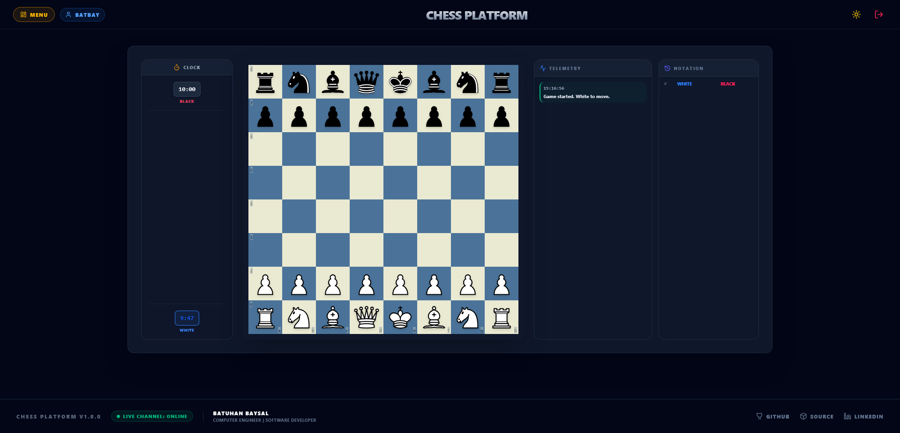

# ♟️ Chess Platform - Frontend


The frontend module of the Chess Platform, built with **React 19**, **TypeScript**, and **Tailwind CSS**. It is designed for high-performance, real-time chess gameplay using a decoupled architecture.

---

## 🖼️ Visuals


*Initial state of the chessboard, showcasing the responsive UI and piece positioning.*


### 🖼️ Feature Gallery
For a detailed visual breakdown of the application features (Authentication, Menu, Gameplay, and Edge Cases), you can browse the full collection of screenshots:

* [**View Detailed Gameplay Screenshots**](../docs/assets/screenshots/02-gameplay-features/)

*Note: The documentation includes detailed visual proofs for core features like white/black check states, pawn promotions, and login validation flows.*

---

## 📝 Project Overview
I built this platform to create a seamless, real-time chess experience. My goal was to move beyond just "making it work" and focus on creating a professional-grade application that feels fast and reliable.

**What I actually built and my contributions:**
* **Real-time Chess Engine:** I personally developed the core engine refactoring and UX optimization to ensure smooth gameplay.
* **User-Centric Features:** I implemented a secure authentication system and notification modules, ensuring users have a safe and connected experience.
* **Professional Standards:** I moved beyond basic functional code by structuring the project for long-term scalability, making it easy to maintain and expand.
* **Production-Ready:** I designed the entire deployment workflow so that the project can be shipped to a server with a single command.

---

## 🏗️ Architecture & Philosophy
This frontend follows a **"Type-Safe Domain Mirroring"** approach to maintain perfect synchronization with our core engine.

* **Domain Mirroring:** TypeScript interfaces are strictly synchronized with Backend Java Records. This ensures compile-time safety and total data consistency across the stack.
* **Server-Side Authority (SSOT):** The backend is the single source of truth. The frontend acts solely as a reactive view layer; it does not independently validate move rules but synchronizes its visual state based on authorized server updates.
* **Reactive Orchestration:** The `useChess.ts` custom hook acts as the brain, managing WebSocket (STOMP) connections, optimistic UI updates, and synchronization with the server-side authority.
* **Hexagonal UI Layers:** We decouple view components (`Square`, `Piece`, `MoveLog`) from state management logic, allowing us to swap UI frameworks without touching the core game orchestration.

---

## 🚀 Engineering Pillars
* **Optimistic UI Updates:** The board state updates locally instantly for fluid UX, with automatic rollback logic if the server rejects the move.
* **Contract-First Development:** API and WebSocket payloads are strictly governed by shared TypeScript models, preventing runtime serialization errors.
* **Atomic State Management:** UI is decomposed into small, reusable atoms, ensuring that state transitions are predictable and easily testable.
* **Resilient Connectivity:** Implements automatic reconnection strategies and heartbeat monitoring for STOMP to ensure seamless real-time play.

---

## 🛠️ Technology Stack
The project leverages industry-standard libraries to provide a type-safe, performant, and consistent experience.

| Category | Technology | Purpose |
| :--- | :--- | :--- |
| **Core** | React 19, TypeScript | Type-safe UI logic and component architecture. |
| **Styling** | Tailwind CSS, Framer Motion | Fluid layouts and reactive UI animations. |
| **Communication** | Stomp.js, SockJS | Real-time WebSocket synchronization with backend. |
| **State** | TanStack Query, Zustand | Server-state management and atomic local state. |
| **Architecture** | Custom Hooks, Zod | Domain logic isolation and schema validation. |
| **Tooling** | Vite, ESLint, Prettier | Optimized bundling and strict code quality. |

---

## 🚀 Getting Started

> **Note:** This frontend is part of a monorepo. For full-stack environment setup, including backend configuration, database requirements, and CI/CD pipelines, please refer to the [**Development & Setup Guide**](../docs/DEVELOPMENT.md).

### Prerequisites
- Node.js (v20+ recommended)
- npm or yarn
- A running instance of the backend on `localhost:8080`

### Installation
```bash
# Install dependencies
npm install
```

### Running the Application
```bash
# Start development server
npm run dev
```

---

## 🛠️ Available Scripts
In the project directory, you can run:

* `npm run dev` - Starts the development server.
* `npm run build` - Builds the app for production to the `dist` folder.
* `npm run lint` - Runs ESLint to check for code quality issues.

---

## ⚙️ Environment Variables
To configure the application, create a `.env` file in the root directory. You can leverage Vite's `import.meta.env` mechanism to inject these variables during the Docker build process or local development.

```env
VITE_API_URL=http://localhost:8080
```

---

## 🐳 Docker Deployment
The application uses a multi-stage Docker build process to ensure high performance and a lightweight production image.

1. **Build Stage:** Uses `node:20-alpine` to compile the TypeScript code and generate static assets.
2. **Serve Stage:** Uses `nginx:stable-alpine` to serve the static files. It includes a `try_files` configuration to handle client-side routing (Single Page Application support), preventing 404 errors on page refresh.

```bash
# Build the image
docker build -t chess-frontend .

# Run the container using orchestration
docker-compose up -d frontend
```

---

## 🛠️ Technical Best Practices
To maintain high performance and code quality, please follow these guidelines:

* **Rendering Performance:** Use `React.memo` within `DraggablePiece` to ensure only specific squares re-render during moves, preventing unnecessary full-board updates.
* **Accessibility:** When using `@dnd-kit`, remember to configure keyboard sensors within `DndContext` to ensure inclusive navigation.
* **State Synchronization:** Always maintain strict synchronization between `useChess` and the server-side authority to prevent lag-induced state mismatches.

---

## 📁 Folder Structure (High-Level)
```
src/
├── api/                # Infrastructure: API clients
├── components/         # Atomic UI components and reusable layout units
│   ├── charts/         # Data visualization components
│   ├── chess/          # Chess engine visualization
│   └── common/         # Shared UI elements
├── features/           # Modular business logic
│   ├── auth/           # Authentication and user session features
│   └── menu/           # Menu-related navigation and logic features
├── hooks/              # Custom React hooks
├── App.tsx             # Global routing and context orchestration
├── index.css           # Global Tailwind CSS and theme variables
└── main.tsx            # Application entry point and DOM initialization
```

---

## ⚠️ Troubleshooting
* **Backend Connection:** Ensure the backend is active on port `8080`, as API services are configured to connect to this base URL.
* **WebSocket Errors:** If connection fails, verify the STOMP/SockJS endpoint configuration in your environment variables.

---

## 📝 Credits
* **Chess Piece Assets:** High-fidelity SVGs sourced from [Wikimedia Commons](https://commons.wikimedia.org/).
* **Icons:** Powered by [Lucide React](https://lucide.dev/).

---
*For global project guidelines, contributing policies, and licensing, please refer to the [root README](../README.md).*
