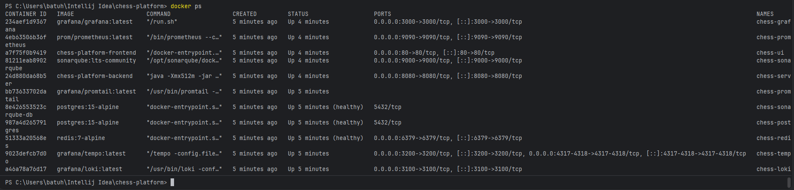
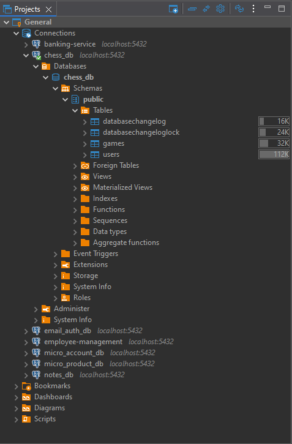
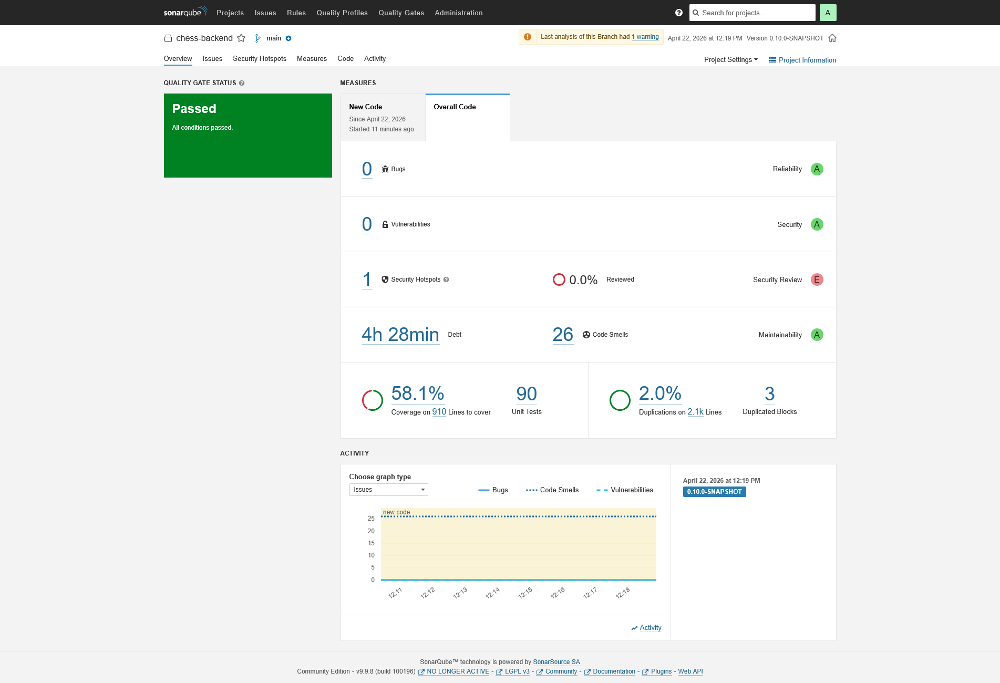
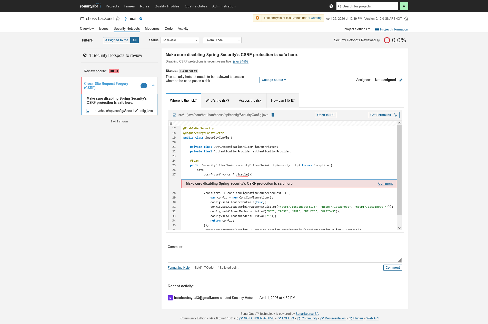

# Infrastructure & Quality Assurance Report

This document details the architectural foundation, monitoring stack, and code quality standards of the Chess Platform. It serves as a visual and technical proof of the project's engineering lifecycle.

---

## 1. Containerization & Database Setup (Phase 10)
> **Goal:** Establish a "Zero-Configuration" environment using Docker and automated migrations.

### 🐳 Docker Orchestration
The entire ecosystem is orchestrated via Docker Compose, ensuring consistency across development and production environments.
* **Containers Status:** 
* **Engine Dashboard:** [View Docker Desktop Metrics](./assets/screenshots/01-infrastructure/docker-setup/01-docker-desktop-dashboard.png)

### 🗄️ Persistence Layer
Database schemas are managed via Liquibase. The following confirms the successful migration and connection to the PostgreSQL instance.
* **Schema Verification:** 

---

## 2. Observability & Monitoring Stack (Phase 11)
> **Goal:** Implement the LGTM stack (Loki, Grafana, Tempo, Mimir) for real-time system transparency.

### 📊 System Health & Metrics
We monitor JVM runtime and infrastructure health through centralized Grafana dashboards.
* **Infrastructure Overview:** [LGTM Stack Connection Map](./assets/screenshots/01-infrastructure/observability-stack/08-lgtm-stack-connection.png)
* **JVM Performance:** * [Runtime & CPU](./assets/screenshots/01-infrastructure/observability-stack/02a-jvm-runtime-metrics.png)
    * [Memory Usage](./assets/screenshots/01-infrastructure/observability-stack/02b-jvm-memory-usage.png)
    * [Garbage Collection](./assets/screenshots/01-infrastructure/observability-stack/02c-jvm-garbage-collection.png)

### 📈 Business Metrics & Quick Facts
Real-time tracking of active games and move executions.
* **Quick Facts Panel:** 

### 🔧 Dashboard Configurations
All Grafana dashboards are exported as version-controlled JSON files to ensure environment portability and rapid recovery.
* **Location:** `docs/assets/dashboards/`
* **Included Dashboards:**
    * `chess-active-games-dashboard.json`: Real-time session monitoring.
    * `chess-total-moves-dashboard.json`: Cumulative business logic metrics.

---

## 3. Quality Assurance & Static Analysis (Phase 12)
> **Goal:** Maintain high engineering standards through SonarQube and JaCoCo.

### 🛡️ SonarQube Quality Gate
This section documents the initial technical debt and baseline code quality metrics.
* **Quality Dashboard (Baseline):** 

### 🧪 Code Coverage & Smells
Detailed breakdown of test coverage and identified areas for improvement.
* **Metric Summary:** [Detailed Metrics](./assets/screenshots/01-infrastructure/sonarqube-initial/02-initial-metrics-summary.png)
* **Coverage Details (58.1%):** [Coverage Map](./assets/screenshots/01-infrastructure/sonarqube-initial/03-initial-coverage-list.png)
* **Code Smells:** [Technical Debt List](./assets/screenshots/01-infrastructure/sonarqube-initial/04-initial-code-smells-list.png)
* **Security Hotspots:** 

---
*Last Updated: 2026-04-22*
