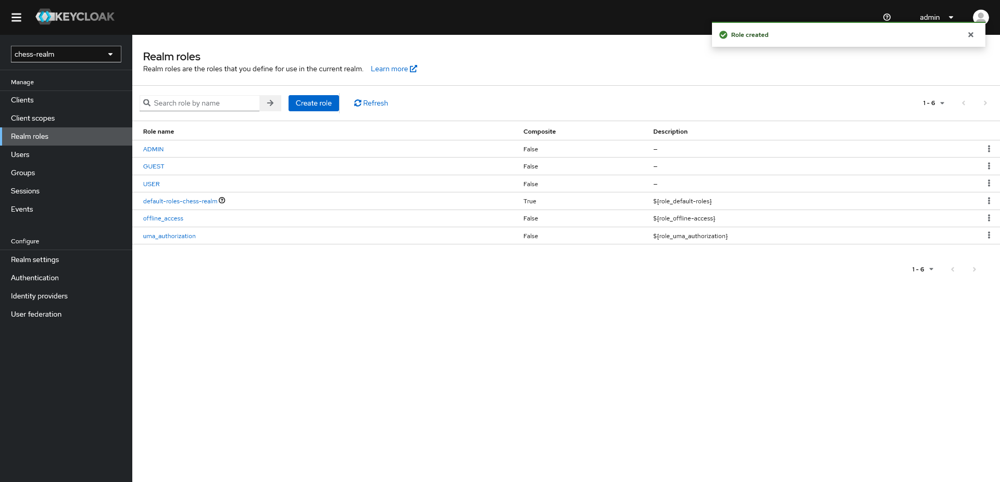
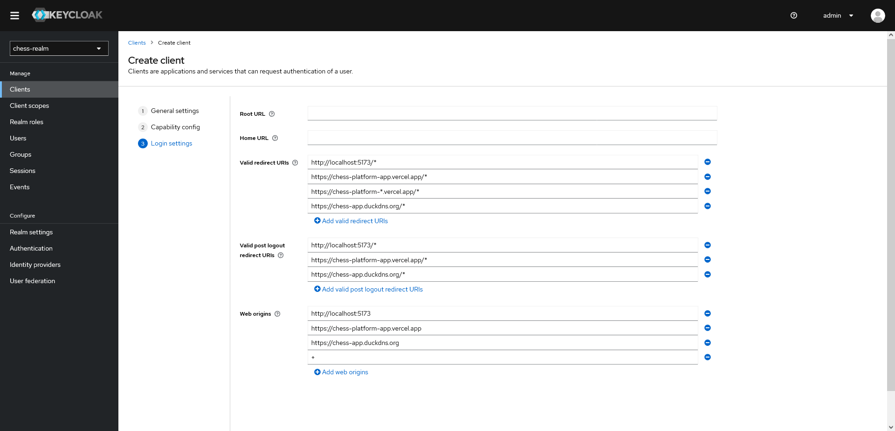
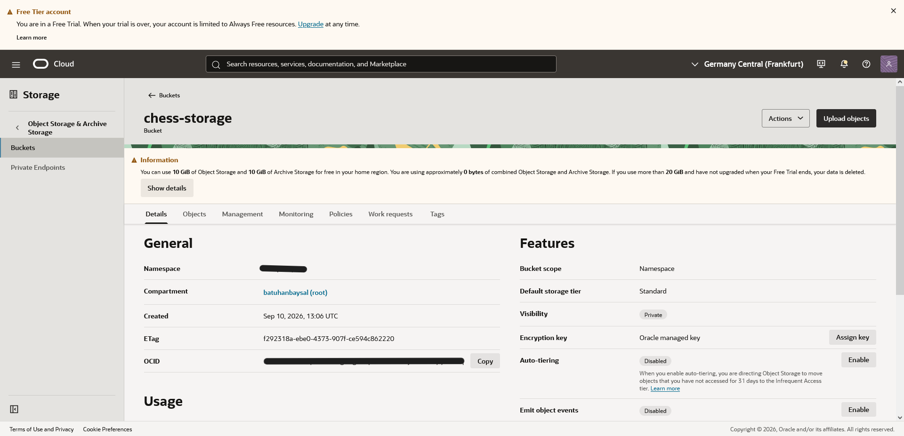
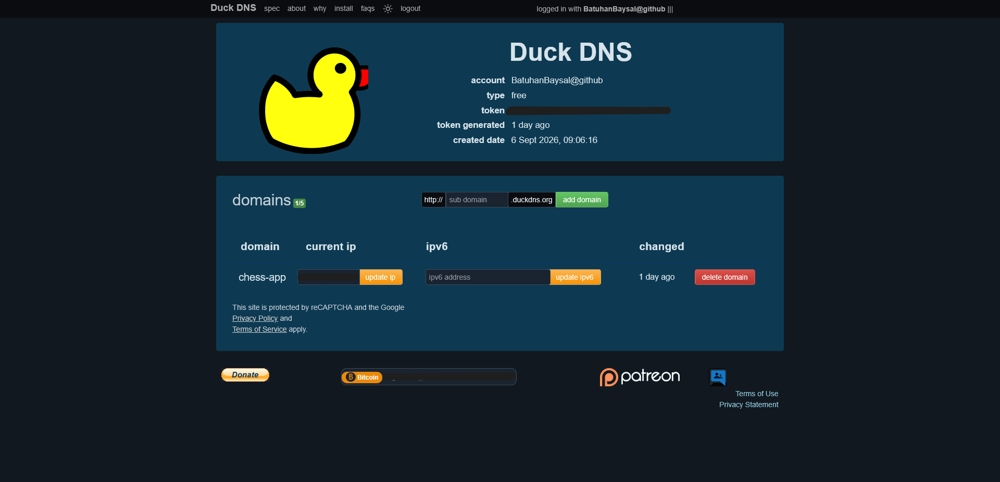

# 🏗️ Infrastructure & Quality Assurance Report

This document details the architectural foundation, monitoring stack, containerized deployments, and code quality standards of the **Chess Platform**, integrating configuration assets (`deploy/monitoring/`, `docker-compose.yml`) and production-grade verification proofs.

---

## 1. Containerization & Database Setup
> **Goal:** Establish a resilient, zero-configuration runtime environment using Docker Compose and automated schema migrations.

### 🐳 Docker Orchestration & Profiles
The application ecosystem is orchestrated via Docker Compose, segmented into isolated execution profiles to balance resource allocation between local development and cloud production:
* **`core` Profile:** Coordinates foundational backend services—Spring Boot application (`chess-server`), PostgreSQL database (`chess-postgres`), Redis cache (`chess-redis`), and Keycloak IAM (`chess-keycloak`).
* **`storage-local` Profile:** Runs local S3-compatible MinIO object storage (`chess-minio`) for avatar and artifact persistence.
* **`monitoring` Profile:** Deploys the LGTM observability pipeline (Prometheus, Grafana, Loki, Tempo, Promtail).

* **Deterministic Dependency Health:** Strict startup ordering guarantees that `chess-server` boots only when PostgreSQL, Redis, and Keycloak report healthy statuses, eliminating race conditions during cold boots.
* **Containers Status:** 
* **Engine Dashboard:** [View Docker Desktop Metrics](../docs/assets/screenshots/01-infrastructure/docker-setup/01-docker-desktop-dashboard.png)

### 🗄️ Persistence Layer & Migrations
Database schemas and index evolutions are managed declaratively using Liquibase migrations against PostgreSQL.
* **Schema Verification:** 

---

## 2. Observability & Monitoring Stack (LGTM)
> **Goal:** Implement the LGTM stack (Loki, Grafana, Tempo, Prometheus) for full-stack transparency across metrics, logs, and distributed traces.

### 📊 System Health & Metrics
System telemetry is aggregated and visualized through provisioned Grafana dashboards configured in `deploy/monitoring/`:
* **Metrics (Prometheus):** Scrapes application health, JVM garbage collection, memory allocations, and custom Spring Actuator meters (`deploy/monitoring/prometheus.yml`).
* **Logs (Loki & Promtail):** Promtail monitors container output and application log streams (`/app/logs/chess-backend.log`), shipping structured JSON records into Loki (`deploy/monitoring/loki-config.yml`).
* **Distributed Tracing (Tempo & OpenTelemetry):** Distributed tracing spans exported via OTLP gRPC/HTTP endpoints (`http://tempo:4318/v1/traces`) track WebSocket payloads and database queries across asynchronous threads.
* **Dashboards & Provisioning:** Automated datasource configurations and visualization panels managed in `deploy/monitoring/grafana/`.

* **Infrastructure Connection Map:** [LGTM Stack Connection Map](../docs/assets/screenshots/01-infrastructure/observability-stack/08-lgtm-stack-connection.png)
* **JVM Performance:**
    * [Runtime & CPU](../docs/assets/screenshots/01-infrastructure/observability-stack/02b-jvm-runtime-metrics.png)
    * [Memory Usage](../docs/assets/screenshots/01-infrastructure/observability-stack/02c-jvm-memory-usage.png)
    * [Garbage Collection](../docs/assets/screenshots/01-infrastructure/observability-stack/02d-jvm-garbage-collection.png)

### 📈 Real-Time Business Metrics
Live counters track active WebSocket sessions, ongoing matches, move executions, and Stockfish AI evaluations.
* **Quick Facts Panel:** 

---

## 3. Quality Assurance, Test Automation & Coverage
> **Goal:** Maintain technical excellence and zero-regression releases through comprehensive test automation and static code validation.

### 🧪 Automated Test Suite & JaCoCo Coverage
The test strategy combines isolated domain unit tests, MockMvc API validation, and Spring Data JPA integration tests running on an isolated H2 in-memory database.

| Metric | Status | Verification Reference |
| :--- | :--- | :--- |
| **Code Coverage** | 74.0% | JaCoCo Maven Plugin Analysis Report |
| **Test Suite** | 384 Passed |  |
| **Technical Debt** | 0 Code Smells | Verified via Static Analysis Rules & Modern Java Patterns |

---

## 4. Cloud Deployment & Production Infrastructure
> **Goal:** Deploy the backend application to an Oracle Cloud Infrastructure (OCI) ARM instance, secure IAM authentication via Keycloak, and configure global frontend distribution.

### 🔐 Identity & Access Management (Keycloak)
* **Role-Based Access Control:** Configured realm roles (`ADMIN`, `USER`, `GUEST`) governing system permissions and endpoint security:  
  
* **OIDC Client & Domain Origins:** Client settings configured with redirect URIs and Web Origins supporting Vercel and DuckDNS endpoints:  
  

### ☁️ Oracle Cloud Infrastructure (OCI) Deployment
The backend ecosystem runs on an Ubuntu 24.04 ARM/Ampere VPS (`chess-platform-prod`) hosted on Oracle Cloud Infrastructure, mapped via dynamic DNS (DuckDNS).

* **Instance Details:** 
* **SSH Connection:** 
* **OCI Object Storage Bucket:** 
* **DuckDNS Routing:** 

#### Server Provisioning & Firewall Configuration
The production host utilizes UFW and OCI Security Lists to expose strictly required ingress ports (HTTP, HTTPS, Backend API, Keycloak, MinIO):

```bash
sudo ufw allow 22/tcp
sudo ufw allow 80/tcp
sudo ufw allow 443/tcp
sudo ufw allow 8080/tcp   # Spring Boot REST / WebSocket API
sudo ufw allow 8081/tcp   # Keycloak IAM Server
sudo ufw allow 3000/tcp   # Grafana Dashboards
sudo ufw allow 9000/tcp   # S3 / MinIO API
sudo ufw allow 9001/tcp   # MinIO Console
sudo ufw enable
```

#### Docker Engine Installation & Verification
```bash
sudo apt-get update && sudo apt-get upgrade -y
sudo apt-get install -y ca-certificates curl gnupg
sudo install -m 0755 -d /etc/apt/keyrings
curl -fsSL [https://download.docker.com/linux/ubuntu/gpg](https://download.docker.com/linux/ubuntu/gpg) | sudo gpg --dearmor -o /etc/apt/keyrings/docker.gpg
sudo chmod a+r /etc/apt/keyrings/docker.gpg
echo "deb [arch=$(dpkg --print-architecture) signed-by=/etc/apt/keyrings/docker.gpg] [https://download.docker.com/linux/ubuntu](https://download.docker.com/linux/ubuntu) $(. /etc/os-release && echo "$VERSION_CODENAME") stable" | sudo tee /etc/apt/sources.list.d/docker.list > /dev/null
sudo apt-get update
sudo apt-get install -y docker-ce docker-ce-cli containerd.io docker-buildx-plugin docker-compose-plugin
sudo usermod -aG docker $USER
```

* **Security List Rules (Ingress):** 
* **Backend Health Check Verification:** 

### 🚀 Vercel Frontend Deployment
The React 19 single-page application is hosted globally on Vercel with automatic continuous integration from the repository's production branch:
* **Project Creation & Config:** 
* **Environment Variables Integration:** Managed via Vercel Project Settings (`VITE_API_URL` pointing to backend host).
* **Production Deployment Status:** 
