# 🏗️ Infrastructure & Quality Assurance Report

This document details the architectural foundation, monitoring stack, and code quality standards of the **Chess Platform**, integrating the setup configuration files (`deploy/monitoring/`) and system verification proof.

---

## 1. Containerization & Database Setup (Phase 10)
> **Goal:** Establish a "Zero-Configuration" environment using Docker and automated migrations.

### 🐳 Docker Orchestration
The entire ecosystem is orchestrated via Docker Compose, ensuring consistency across development and production environments.

* **Containers Status:** 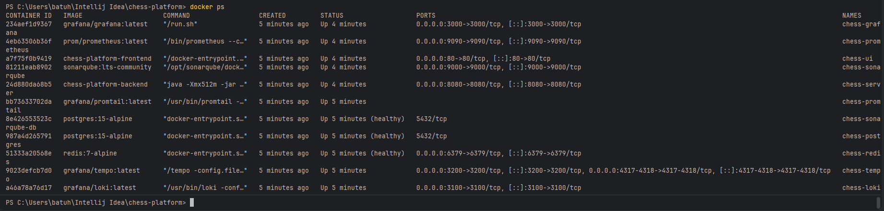
* **Engine Dashboard:** [View Docker Desktop Metrics](../docs/assets/screenshots/01-infrastructure/docker-setup/01-docker-desktop-dashboard.png)

### 🗄️ Persistence Layer
Database schemas are managed via Liquibase. The following confirms the successful migration and connection to the PostgreSQL instance.

* **Schema Verification:** 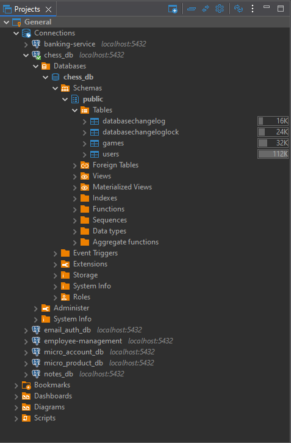

---

## 2. Observability & Monitoring Stack (Phase 11)
> **Goal:** Implement the LGTM stack (Loki, Grafana, Tempo, Prometheus) for real-time system transparency.

### 📊 System Health & Metrics
We monitor JVM runtime and infrastructure health through centralized Grafana dashboards. The raw provisioning and dashboard files are organized under the `deploy/monitoring/` directory:
* **Dashboard JSON:** Defined in `deploy/monitoring/grafana/dashboards/chess-metrics.json`.
* **Provisioning:** Managed via `deploy/monitoring/grafana/provisioning/` (datasources configured for Prometheus, Loki, and Tempo).
* **Scraping Configurations:** Scraped via Prometheus (`deploy/monitoring/prometheus.yml`), Loki (`deploy/monitoring/loki-config.yml`), Promtail (`deploy/monitoring/promtail-config.yml`), and Tempo (`deploy/monitoring/tempo.yml`).

* **Infrastructure Overview:** [LGTM Stack Connection Map](../docs/assets/screenshots/01-infrastructure/observability-stack/08-lgtm-stack-connection.png)
* **JVM Performance:**
    * [Runtime & CPU](../docs/assets/screenshots/01-infrastructure/observability-stack/02b-jvm-runtime-metrics.png)
    * [Memory Usage](../docs/assets/screenshots/01-infrastructure/observability-stack/02c-jvm-memory-usage.png)
    * [Garbage Collection](../docs/assets/screenshots/01-infrastructure/observability-stack/02d-jvm-garbage-collection.png)

### 📈 Business Metrics
Real-time tracking of active games and move executions.

* **Quick Facts Panel:** 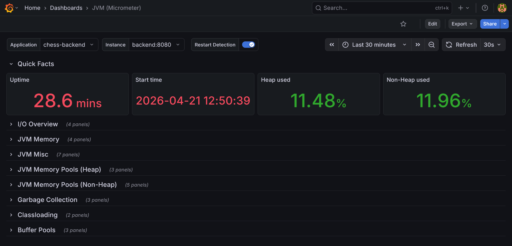

---

## 3. Quality Assurance & Static Analysis (Phase 12)
> **Goal:** Reach "Gold Standard" technical quality through comprehensive testing and refactoring.

### 🛡️ SonarQube Quality Gate: PASSED 🏆
The project has officially cleared the Quality Gate with "A" ratings across all major categories.

* **Token Setup:** 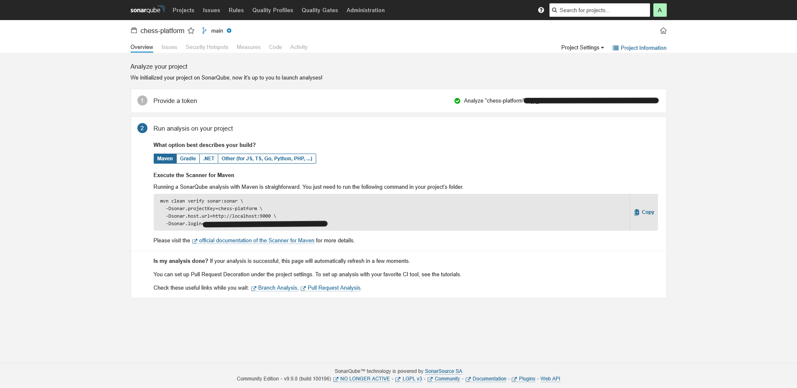
* **Analysis Execution:** 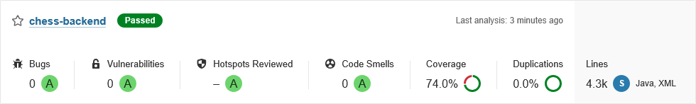
* **Initial Dashboard:** 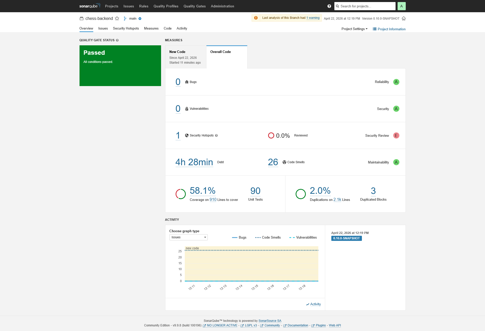
* **Final Quality Dashboard:** 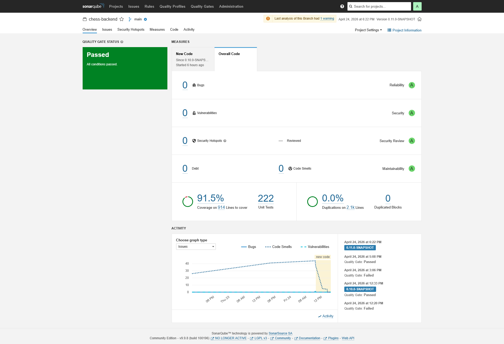
* **Initial Overview:** 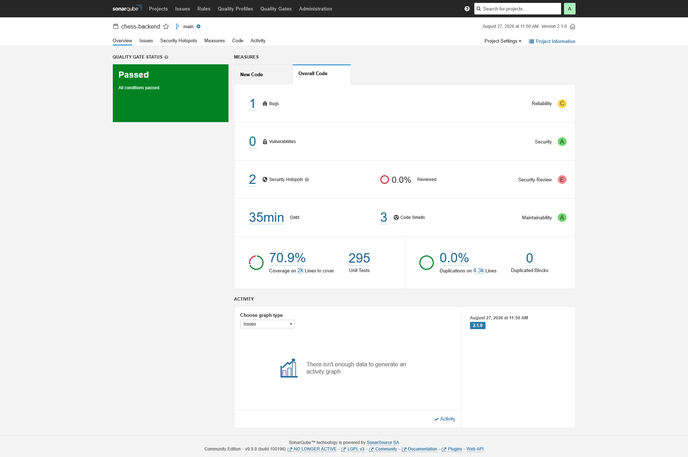
* **Final Overview:** 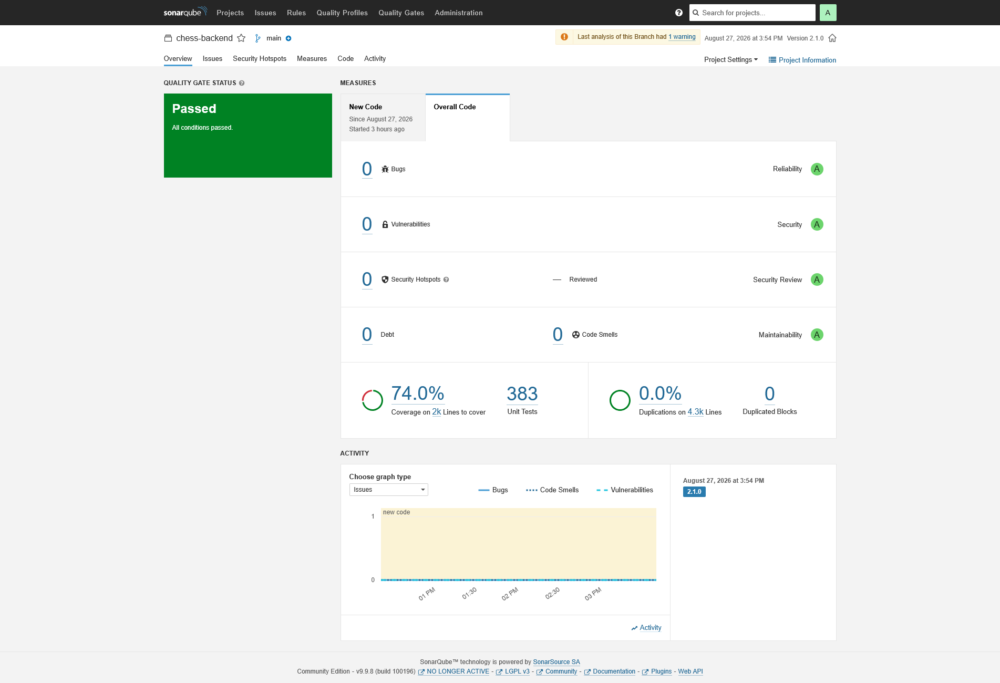

### 🧪 Code Coverage
Significant expansion of the test suite to ensure the integrity of FIDE chess logic.

| Metric | Status     | Proof |
| :--- |:-----------| :--- |
| **Code Coverage** | 74.0%      | 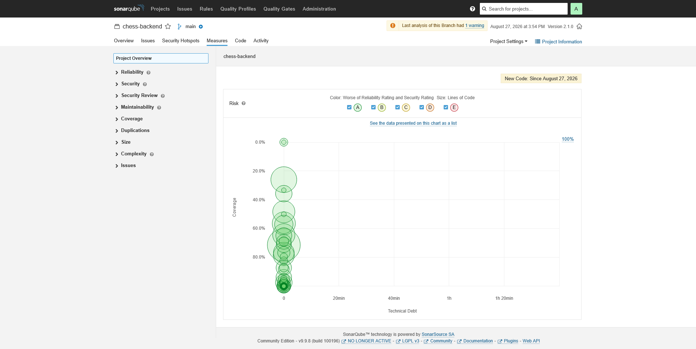 |
| **Test Suite** | 384 Passed | 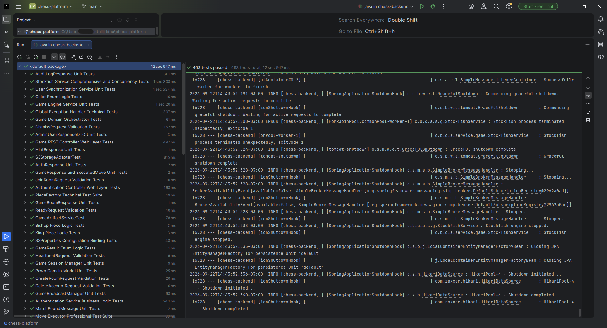 |

### 🧹 Clean Code & Debt Elimination
Rigorous refactoring to eliminate technical debt and code smells.

* **Zero-Issue Baseline:** Successfully reached **0 Code Smells** and **0 Technical Debt**.
* **IDE-Level Guardrails:** [SonarLint Analysis Results](../docs/assets/screenshots/01-infrastructure/sonarqube/03-sonarqube-ide-analysis.png)

---

## 4. Cloud Deployment & Production Infrastructure (Phase 21)
> **Goal:** Deploy the backend services to an Oracle Cloud Infrastructure (OCI) ARM instance and configure frontend hosting on Vercel.

### ☁️ Oracle OCI Server Setup & Firewall
The production backend runs on an Ubuntu 24.04 ARM instance (`chess-platform-prod`) hosted on Oracle Cloud Infrastructure (OCI).

* **Instance Details:** 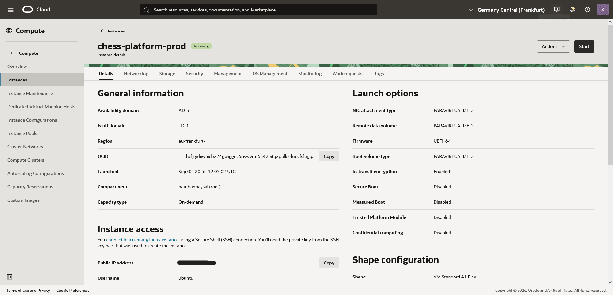
* **SSH Connection:** 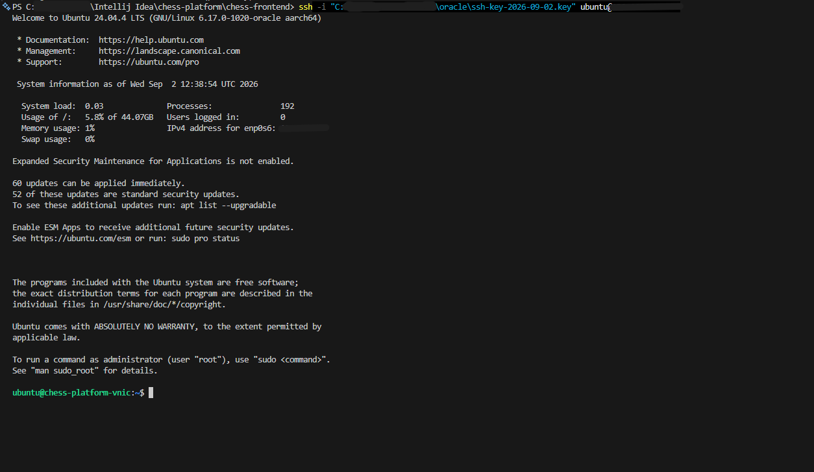

#### Server Provisioning & Docker Installation
The server was initialized with secure UFW firewall rules and Docker engine setups:
```bash
sudo ufw allow 22/tcp
sudo ufw allow 80/tcp
sudo ufw allow 443/tcp
sudo ufw allow 8080/tcp
sudo ufw allow 3000/tcp
sudo ufw allow 9000/tcp
sudo ufw enable
sudo apt-get update && sudo apt-get upgrade -y
sudo apt-get install -y ca-certificates curl gnupg
sudo install -m 0755 -d /etc/apt/keyrings
curl -fsSL [https://download.docker.com/linux/ubuntu/gpg](https://download.docker.com/linux/ubuntu/gpg) | sudo gpg --dearmor -o /etc/apt/keyrings/docker.gpg
sudo chmod a+r /etc/apt/keyrings/docker.gpg
echo "deb [arch=$(dpkg --print-architecture) signed-by=/etc/apt/keyrings/docker.gpg] [https://download.docker.com/linux/ubuntu](https://download.docker.com/linux/ubuntu) $(. /etc/os-release && echo "$VERSION_CODENAME") stable" | sudo tee /etc/apt/sources.list.d/docker.list > /dev/null
sudo apt-get update
sudo apt-get install -y docker-ce docker-ce-cli containerd.io docker-buildx-plugin docker-compose-plugin
sudo usermod -aG docker $USER
```

* **Security List Rules (Ingress):** 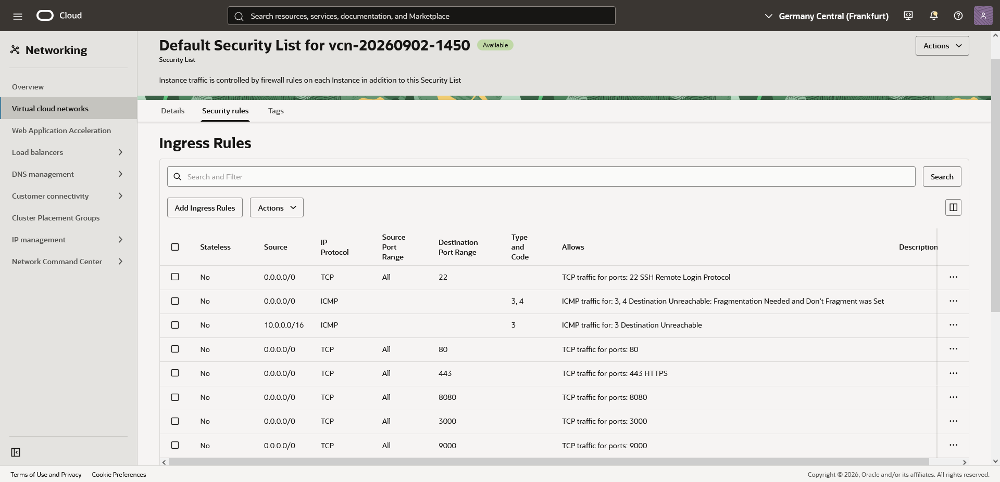
* **Backend Health Check Verification:** 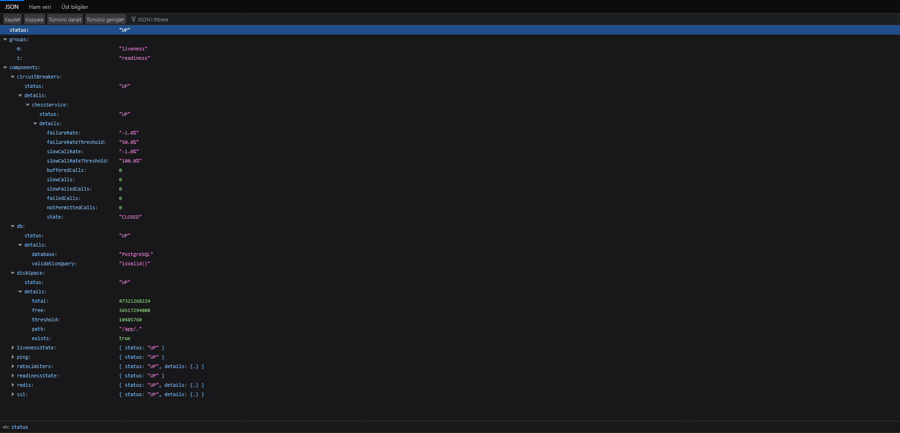

### 🚀 Vercel Frontend Deployment
The frontend client (`chess-platform`) is deployed and continuously integrated via Vercel.

* **Project Creation:** 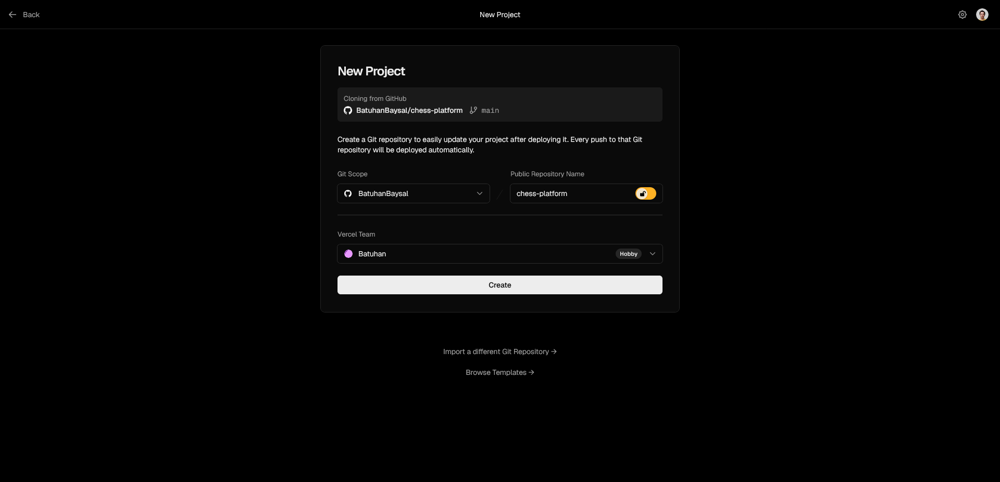
* **Environment Configuration:** 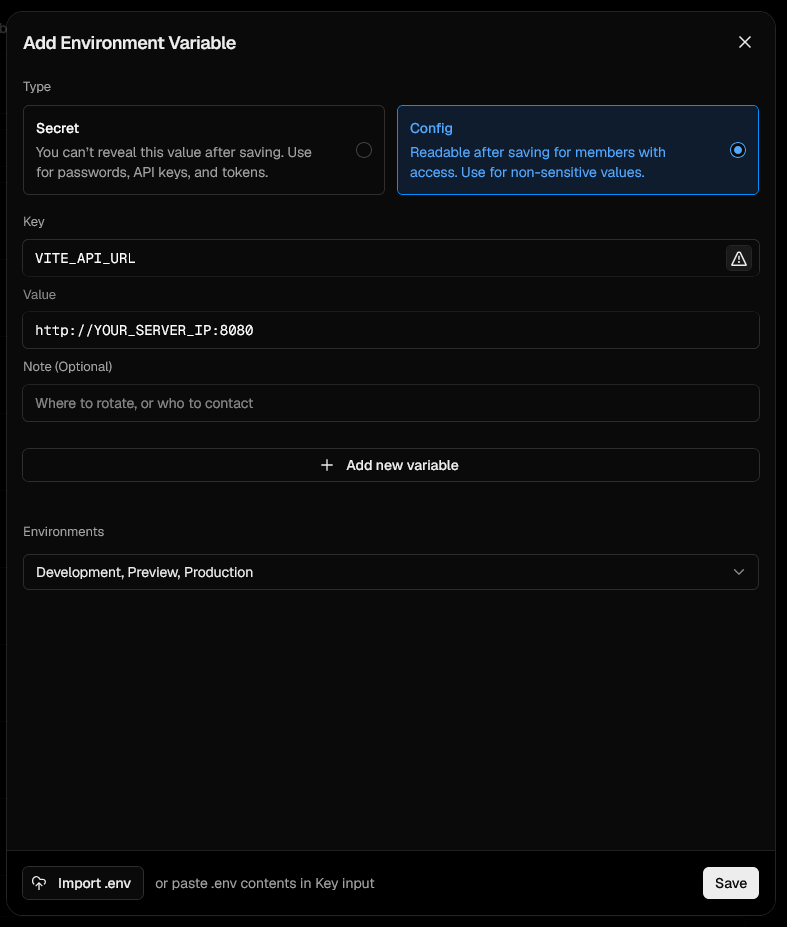
* **Environment Variables List:** 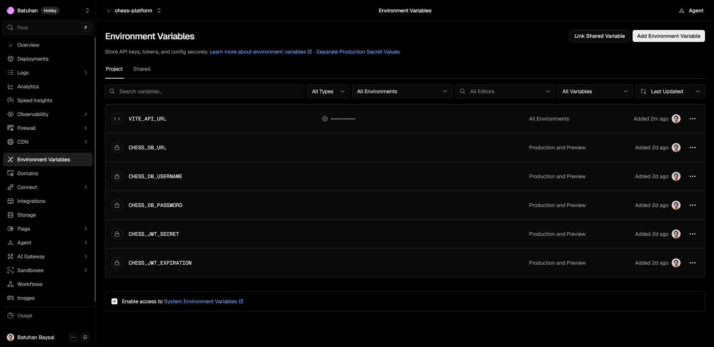
* **Deployment Success:** 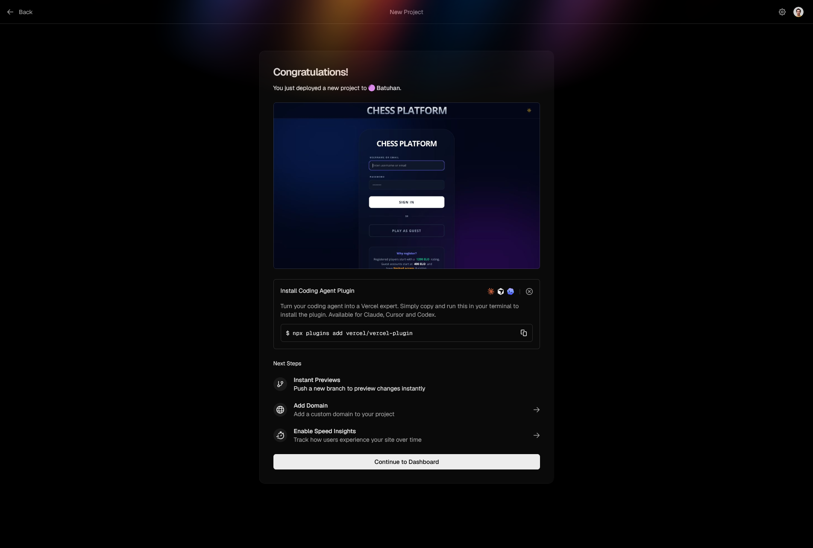
